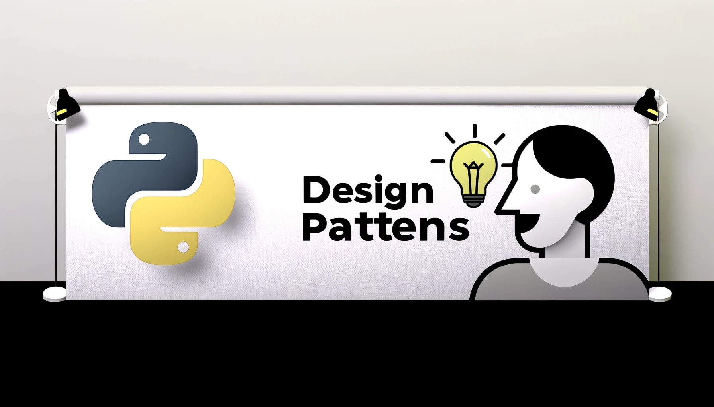

<br>
<p align="center">
  
</p>

***

<p align="center">
🎉 Ultra-simplified explanation to design patterns! Python Version (In-progress) 🎉
</p>
<p align="center">
A topic based on [design-patterns-for-humans](https://github.com/kamranahmedse/design-patterns-for-humans) the great source explain about design pattern.
</p>

***

<sub>Check out main source [design-patterns-for-humans](https://github.com/kamranahmedse/design-patterns-for-humans) </sub>

<sub>Reference [Refactoring-DESIGN PATTERNS](https://refactoring.guru/design-patterns) </sub>

<br>

|[Creational Design Patterns](#creational-design-patterns)|[Structural Design Patterns](#structural-design-patterns)|[Behavioral Design Patterns](#behavioral-design-patterns)|
|:-|:-|:-|
|[Simple Factory](#-simple-factory)|[Adapter](#-adapter)|[Chain of Responsibility](#-chain-of-responsibility)|
|[Factory Method](#-factory-method)|[Bridge](#-bridge)|[Command](#-command)|
|[Abstract Factory](#-abstract-factory)|[Composite](#-composite)|[Iterator](#-iterator)|
|[Builder](#-builder)|[Decorator](#-decorator)|[Mediator](#-mediator)|
|[Prototype](#-prototype)|[Facade](#-facade)|[Memento](#-memento)|
|[Singleton](#-singleton)|[Flyweight](#-flyweight)|[Observer](#-observer)|
||[Proxy](#-proxy)|[Visitor](#-visitor)|
|||[Strategy](#-strategy)|
|||[State](#-state)|
|||[Template Method](#-template-method)|

<br>

Introduction
=================

Design patterns are solutions to recurring problems; **guidelines on how to tackle certain problems**. They are not classes, packages or libraries that you can plug into your application and wait for the magic to happen. These are, rather, guidelines on how to tackle certain problems in certain situations.

> Design patterns are solutions to recurring problems; guidelines on how to tackle certain problems

Wikipedia describes them as

> In software engineering, a software design pattern is a general reusable solution to a commonly occurring problem within a given context in software design. It is not a finished design that can be transformed directly into source or machine code. It is a description or template for how to solve a problem that can be used in many different situations.

⚠️ Be Careful
-----------------
- Design patterns are not a silver bullet to all your problems.
- Do not try to force them; bad things are supposed to happen, if done so. 
- Keep in mind that design patterns are solutions **to** problems, not solutions **finding** problems; so don't overthink.
- If used in a correct place in a correct manner, they can prove to be a savior; or else they can result in a horrible mess of a code.

> Also note that the code samples below are in PYTHON, however this shouldn't stop you because the concepts are same anyways.

Types of Design Patterns
-----------------

* [Creational](#creational-design-patterns)
* [Structural](#structural-design-patterns)
* [Behavioral](#behavioral-design-patterns)

Creational Design Patterns
==========================
What is Creational Design Patterns ?
> Creational design patterns are fundamental patterns that deal with object creation mechanisms, aiming to create objects in a manner suitable to the situation. The basic form of object creation could lead to design problems or added complexity to the design. Creational design patterns **solve specific problems by controlling this object creation process**. **Each pattern addresses a unique issue that can arise during object creation.**


In plain words
> Creational patterns are focused towards how to instantiate an object or group of related objects.

Wikipedia says
> In software engineering, creational design patterns are design patterns that deal with object creation mechanisms, trying to create objects in a manner suitable to the situation. The basic form of object creation could result in design problems or added complexity to the design. Creational design patterns solve this problem by somehow controlling this object creation.

[refactoring](https://refactoring.guru/design-patterns/creational-patterns)
> Creational design patterns provide various object creation mechanisms, which increase flexibility and reuse of existing code.


 * [Simple Factory](#-simple-factory)
 * [Factory Method](#-factory-method)
 * [Abstract Factory](#-abstract-factory)
 * [Builder](#-builder)
 * [Prototype](#-prototype)
 * [Singleton](#-singleton)

🏠 Simple Factory
--------------
Problem Simple Factory Solves:
> The Simple Factory pattern addresses the problem of creating objects without specifying the exact class of object that will be created. This is particularly useful in scenarios where a system should be flexible regarding the objects it needs to create.

> **Common Issue**: Directly instantiating objects within your code (using the new operator or equivalent) tightly couples your code to specific classes, making it less flexible and more difficult to change. For example, if you're directly creating instances of a Car class throughout your application and decide to introduce a Truck class or change the way Car instances are created, you would need to search through your entire codebase to make changes.


Real world example
> we'll create a factory for producing different types of vehicles. Each vehicle type (like Car, Truck) will be a class, and the VehicleFactory will decide which vehicle class to instantiate based on a parameter

In plain words
> Simple factory simply generates an instance for client without exposing any instantiation logic to the client

Wikipedia says
> In object-oriented programming (OOP), a factory is an object for creating other objects – formally a factory is a function or method that returns objects of a varying prototype or class from some method call, which is assumed to be "new".

**Programmatic Example**

### Step 1: we define the classes for the different types of vehicles.
```python
class Car:
    def drive(self):
        return "Driving Car"

class Truck:
    def drive(self):
        return "Driving Truck"
```
### Step 2: Create the Simple Factory
```python
class VehicleFactory:

    @staticmethod
    def get_vehicle(vehicle_type):
        if vehicle_type == 'car':
            return Car()
        elif vehicle_type == 'truck':
            return Truck()
        else:
            raise ValueError("Vehicle type not supported")
```
### Using the Factory
```python
# Creating a car
vehicle = VehicleFactory.get_vehicle('car')
print(vehicle.drive())  # Output: Driving car

# Creating a truck
vehicle = VehicleFactory.get_vehicle('truck')
print(vehicle.drive())  # Output: Driving Truck
```

**When to Use?**

When creating an object is not just a few assignments and involves some logic, it makes sense to put it in a dedicated factory instead of repeating the same code everywhere.

🏭 Factory Method
--------------
Problem it solves: 
> Defines an interface for creating an object but lets subclasses decide which class to instantiate. Factory Method lets a class defer instantiation to subclasses.
> **Common issue**: Direct object creation (using new operator) within a class makes the class dependent on the concrete class being instantiated. This can reduce the flexibility of the class, making it harder to extend and violating the open/closed principle.

Real world example
> In the context of a car manufacturing process, imagine a system where the manufacturing manager needs to delegate the construction of cars to specific assembly lines based on the car model. The Creator decides and delegates the car construction to best suited for model.

In plain words
> It provides a way to delegate the instantiation logic to child classes.

Wikipedia says
> In class-based programming, the factory method pattern is a creational pattern that uses factory methods to deal with the problem of creating objects without having to specify the exact class of the object that will be created. This is done by creating objects by calling a factory method—either specified in an interface and implemented by child classes, or implemented in a base class and optionally overridden by derived classes—rather than by calling a constructor.

 **Programmatic Example**


```python
from abc import ABC, abstractmethod

class Car(ABC):
    @abstractmethod
    def drive(self):
        pass

class Sedan(Car):
    def drive(self):
        return "Driving a Sedan"

class SUV(Car):
    def drive(self):
        return "Driving an SUV"
```

Now let us create our `CarCreator`

```python
class CarCreator(ABC):
    @abstractmethod
    def create_car(self) -> Car:
        pass

    def get_car_info(self):
        car = self.create_car()
        return car.drive()

```
Now any child can extend it and provide the required car info
```python
class SedanCreator(CarCreator):
    def create_car(self):
        return Sedan()

class SUVCreator(CarCreator):
    def create_car(self):
        return SUV()

```
and then it can be used as

```python
sedan_creator = SedanCreator()
print(sedan_creator.get_car_info())  # Output: Driving a sedan

suv_creator = SUVCreator()
print(suv_creator.get_car_info())  # Output: Driving an SUV

```
**When to use?**
Useful when there is some generic processing in a class but the required sub-class is dynamically decided at runtime. Or putting it in other words, when the client doesn't know what exact sub-class it might need.
* [Pros and Cons](https://refactoring.guru/design-patterns/factory-method)
    * Pros: 
        * You avoid tight coupling between the creator and the concrete products.
        * Single Responsibility Principle. You can move the product creation code into one place in the program, making the code easier to support.
        * Open/Closed Principle. You can introduce new types of products into the program without breaking existing client code.
    * Cons: 
        * The code may become more complicated since you need to introduce a lot of new subclasses to implement the pattern. The best case scenario is when you’re introducing the pattern into an existing hierarchy of creator classes.

*  Relations with Other Patterns - Update later

---
🔨 Abstract Factory
----------------
Problem it solves: 
> Provides an interface for creating families of related or dependent objects without specifying their concrete classes. It's useful when a system needs to be independent of how its products are created, composed, or represented.
> **Common issue**: When there are interdependencies between the creation of various objects that could belong to multiple families but need to work together. Directly creating these objects can lead to tight coupling between classes. 

Real world example
> Let's illustrate the Abstract Factory pattern with a car example. Suppose we have two types of cars: Electric and Gasoline. Each type of car can come in different models, such as Sedan and SUV. We'll create an abstract factory that can produce these cars, along with concrete factories for each type (Electric and Gasoline).

In plain words
> A factory of factories; a factory that groups the individual but related/dependent factories together without specifying their concrete classes.

Wikipedia says
> The abstract factory pattern provides a way to encapsulate a group of individual factories that have a common theme without specifying their concrete classes

Refactoring guru
> Abstract Factory is a creational design pattern that lets you produce families of related objects without specifying their concrete classes.

**Programmatic Example**

### Define interfaces 
Define interfaces for each type of product that will be created. In our case, the products are cars, and we'll have two types: Sedan and SUV.

```python
class Sedan(ABC):
    @abstractmethod
    def describe(self):
        pass

class SUV(ABC):
    @abstractmethod
    def describe(self):
        pass
```
### Implement concrete
Implement concrete classes for each product family. Here, we have Electric and Gasoline versions of Sedan and SUV.

```python
class ElectricSedan(Sedan):
    def describe(self):
        return "Electric Sedan"

class ElectricSUV(SUV):
    def describe(self):
        return "Electric SUV"

class GasolineSedan(Sedan):
    def describe(self):
        return "Gasoline Sedan"

class GasolineSUV(SUV):
    def describe(self):
        return "Gasoline SUV"

```
### Define an abstract factory
Define an abstract factory interface with methods to create all types of products.
```python
class CarFactory(ABC):
    @abstractmethod
    def create_sedan(self):
        pass

    @abstractmethod
    def create_suv(self):
        pass
```

### Implement concrete factories
Implement concrete factories for each type of car. Each factory will create both Sedan and SUV vehicles of its type.

```python
class ElectricCarFactory(CarFactory):
    def create_sedan(self):
        return ElectricSedan()

    def create_suv(self):
        return ElectricSUV()

class GasolineCarFactory(CarFactory):
    def create_sedan(self):
        return GasolineSedan()

    def create_suv(self):
        return GasolineSUV()

```
### Can be used as
And then it can be used as
```python
def describe_car(factory: CarFactory):
    sedan = factory.create_sedan()
    suv = factory.create_suv()
    print(sedan.describe())
    print(suv.describe())

# Create Electric Cars
electric_factory = ElectricCarFactory()
describe_car(electric_factory)

# Create Gasoline Cars
gasoline_factory = GasolineCarFactory()
describe_car(gasoline_factory)

```

*This example demonstrates how the Abstract Factory pattern can be used to create families of related objects. The key benefit is that it isolates concrete classes, making the system easier to extend and swap out families of related objects all at once. As new types of cars (like hybrid) or new car models are introduced, you can simply add new concrete factories and products without affecting the existing code.*

**When to use?**

When there are interrelated dependencies with not-that-simple creation logic involved

* **When to Use Abstract Factory - Src: ChatGPT**
    * Use when:

        * Needs to work with various families of related products, but you don't want it to depend on the concrete classes of those products - They might be unknown beforehand or you want o allow for future scalability

        * You have a class with a set of Factory Methods that blur its primary responsibility. In such a case, an Abstract Factory can act as a delegate to handle the object creation aspect of the class.

        * You want to provide a library of products without exposing the implementation logic.

    * Don't use when:

        * The application only deals with a single family of products => Using an Abstract Factory would add unnecessary complexity

        * Dealing with single object creation needs that can be handled by a constructor or a simple Factory Method. Over-engineering by introducing an Abstract Factory can make the codebase more difficult to understand and maintain.

*  [**Pros and Cons**](https://refactoring.guru/design-patterns/abstract-factory)

    * Pros:

        * Can be sure that the products getting from a factory are compatible with each other.

        * Avoid tight coupling between concrete products and client code.

        * Single Responsibility Principle - Can extract the product creation code into one place, making the code easier to support.

        * Open/Closed Principle - Introduce new variants of products without breaking existing client code.

    * Cons:

        * The code may become more complicated than it should be, since a lot of new interfaces and classes are introduced along with the pattern.

* Relations with Other Patterns - Update later

👷 Builder
--------------------------------------------
Problem it solves: 
> Separates the construction of a complex object from its representation so that the same construction process can create different representations. This pattern is useful when an object needs to be initialized with numerous fields, some of which may be optional.
> **Common issue**: The use of multiple constructors to create an object with various configurations can lead to a proliferation of constructor parameters (telescoping constructor anti-pattern), making the code hard to read and maintain.

Real world example
> Imagine you're creating a software system for a car manufacturer, allowing customers to customize their cars. A car might have various features to choose from, such as engine type, wheels, seats, GPS, etc. Not all customers want the same features, and some features are optional.

In plain words
> Allows you to create different flavors of an object while avoiding constructor pollution. Useful when there could be several flavors of an object. Or when there are a lot of steps involved in creation of an object.

Wikipedia says
> The builder pattern is an object creation software design pattern with the intentions of finding a solution to the telescoping constructor anti-pattern.

[Refactoring Intent](https://refactoring.guru/design-patterns/builder)
> Builder is a creational design pattern that lets you construct complex objects step by step. The pattern allows you to produce different types and representations of an object using the same construction code.

Having said that let me add a bit about what telescoping constructor anti-pattern is. At one point or the other we have all seen a constructor like below:

### **Product**: 
The Car class represents the final product, including various features that can be customized.
```python
class Car:
    def __init__(self):
        self.engine = None
        self.seats = None
        self.color = None
        self.wheels = None
        self.has_gps = False

    def specifications(self):
        specs = (
            f"Engine: {self.engine}, "
            f"Seats: {self.seats}, "
            f"Color: {self.color}, "
            f"Wheels: {self.wheels}, "
            f"GPS: {'Yes' if self.has_gps else 'No'}"
        )
        return specs

```

### **Builder Interface**:
This interface declares the construction steps used to create a car.

```python
class CarBuilder(ABC):
    @abstractmethod
    def set_engine(self, engine):
        pass

    @abstractmethod
    def set_seats(self, seats):
        pass

    @abstractmethod
    def set_color(self, color):
        pass

    @abstractmethod
    def set_wheels(self, wheels):
        pass

    @abstractmethod
    def set_gps(self, has_gps):
        pass

```

### **Concrete Builders**
Implementations of the CarBuilder for different types of cars, like Sedan and SUV.

```python
class SedanBuilder(CarBuilder):
    def __init__(self):
        self.reset()

    def reset(self):
        self.car = Car()

    def set_engine(self, engine):
        self.car.engine = engine

    def set_seats(self, seats):
        self.car.seats = seats

    def set_color(self, color):
        self.car.color = color

    def set_wheels(self, wheels):
        self.car.wheels = wheels

    def set_gps(self, has_gps):
        self.car.has_gps = has_gps

    def get_result(self):
        return self.car

class SUVBuilder(CarBuilder):
    # SUVBuilder would have similar implementation as SedanBuilder
    # but potentially with different defaults or options specific to SUVs
    pass
```

### **Director**
The Director class, which is optional but useful for defining the order of building steps.
```python
class Director:
    def __init__(self, builder):
        self._builder = builder

    def construct_sports_car(self):
        self._builder.set_engine("V8")
        self._builder.set_seats(2)
        self._builder.set_color("Red")
        self._builder.set_wheels(4)
        self._builder.set_gps(True)

    def construct_family_car(self):
        self._builder.set_engine("V6")
        self._builder.set_seats(5)
        self._builder.set_color("Blue")
        self._builder.set_wheels(4)
        self._builder.set_gps(True)

```
### **Client**
The client code which uses the director and builder to construct the car.

```python
# Constructing a sports car
builder = SedanBuilder()
director = Director(builder)
director.construct_sports_car()
car = builder.get_result()
print(car.specifications())

# Constructing a family car, using the same builder and director
director.construct_family_car()
car = builder.get_result()
print(car.specifications())

```

* **When to use?**

    * When there could be several flavors of an object and to avoid the constructor telescoping. The key difference from the factory pattern is that; factory pattern is to be used when the creation is a one step process while builder pattern is to be used when the creation is a multi step process.

    * Don't use when:

        * The process of constructing the object is straightforward and can be managed with a simple constructor call. In this case, applying the Builder pattern might be overkill and unnecessarily complicate the design.

* [**Pros and Cons**](https://refactoring.guru/design-patterns/builder)

    * Pros:
        * Construct objects step-by-step - defer construction steps or run steps recursively.

        * Reuse the same construction code when building various representation of products.

        * *Single Responsibility Principle* - can isolate complex construction code from the business logic of the product.
    
    * Cons:
        * The overall complexity of the code increases since the pattern requires creating multiple new classes.

🐑 Prototype
------------
Problem it solves: 
> Specifies the kind of objects to create using a prototypical instance and creates new objects by copying this prototype. It's particularly useful when the cost of creating an object is more expensive or more complex than copying an existing one.
> **Common issue**: When instances of a class can have only a few different combinations of states, it may be more convenient to clone an existing instance instead of constructing a new one, especially when objects require a significant amount of resources to create from scratch.

Real world example
> Remember dolly? The sheep that was cloned! Lets not get into the details but the key point here is that it is all about cloning

In plain words
> Create object based on an existing object through cloning.

Wikipedia says
> The prototype pattern is a creational design pattern in software development. It is used when the type of objects to create is determined by a prototypical instance, which is cloned to produce new objects.

Refactoring Intent
> Prototype is a creational design pattern that lets you copy existing objects without making your code dependent on their classes.


In short, it allows you to create a copy of an existing object and modify it to your needs, instead of going through the trouble of creating an object from scratch and setting it up.

**Programmatic Example**
<details>
<summary>Why Use a CarPrototype Instead of Cloning Directly</summary>

* **Standardization of Cloning**: By implementing a CarPrototype class, you encapsulate the cloning process. This means you can make sure all cars are cloned in a consistent manner, respecting any invariants or specific cloning behaviors (deep vs. shallow copy) that your application requires.

* **Extensibility**: A CarPrototype class allows for easier extension. If in the future you need to add more complex logic during the cloning process (e.g., registering the clone with a logger, modifying certain properties based on context, or implementing post-clone initialization steps), having a dedicated prototype class or interface makes these enhancements much simpler and centralized.

* **Subclassing Flexibility**: If your application deals with different types of cars (e.g., ElectricCar, GasolineCar, etc.), using a prototype pattern with a base CarPrototype can simplify the creation of new instances of these subclasses. Each subclass can override the cloning method to ensure that it returns the correct type of object, preserving the subtype.

* **Decoupling Object Creation**: It abstracts the concrete classes of objects being created from the code that needs these objects. By cloning objects from a prototype, the system can remain agnostic about the types of objects it works with, thus following the Open/Closed Principle more closely.
Step 2: Create Concrete Prototypes
Implement the prototype interface in a concrete class. Here, we'll create a Car class that includes various attributes a car might have, like model, color, and accessories. This class will inherit from the CarPrototype and implement the clone method.
</details>

---
### Step 1: Define the Prototype Interface
First, define an interface that includes a method for cloning objects. In Python, this can be achieved using the copy module, which provides the copy() and deepcopy() functions for shallow and deep copies, respectively.

```python
class CarPrototype:
    def clone(self):
        return copy.deepcopy(self)
```


### Step 2: Create Concrete Prototypes
Implement the prototype interface in a concrete class. Here, we'll create a Car class that includes various attributes a car might have, like model, color, and accessories. This class will inherit from the CarPrototype and implement the clone method.
```python
class Car(CarPrototype):
    def __init__(self, model, color):
        self.model = model
        self.color = color
        self.accessories = []

    def add_accessory(self, accessory):
        self.accessories.append(accessory)

    def __str__(self):
        return f"Model: {self.model}, Color: {self.color}, Accessories: {', '.join(self.accessories)}"

```

### Step 3: Use the Prototype
Now, you can create a prototype instance of a car and clone it to create new cars, customizing each as necessary.

``` python
# Creating the prototype
prototype_car = Car("Basic Model", "White")

# Cloning the prototype to create a new car
car1 = prototype_car.clone()
car1.model = "Sedan"
car1.color = "Blue"
car1.add_accessory("Sunroof")

car2 = prototype_car.clone()
car2.model = "SUV"
car2.color = "Black"
car2.add_accessory("Leather seats")

print(car1)  # Model: Sedan, Color: Blue, Accessories: Sunroof
print(car2)  # Model: SUV, Color: Black, Accessories: Leather seats

```


* **When to use?**

    * When an object is required that is similar to existing object or when the creation would be expensive as compared to cloning.

    * Avoid the sub-classing of an object creator (like in the Factory Method pattern) just to create specialized objects.

    * Maintain state uniqueness while instances share structure (data formats, configuration).

    * Don't use when:

        * Objects don’t have much in common with the initialization process. In such cases, duplicating objects might lead to duplicating code, which contradicts the *DRY (Don't Repeat Yourself)* principle.
            <details>
            <summary>Example</summary>

            ```python
            class ElectricCar:
                def __init__(self, battery_capacity):
                    self.battery_capacity = battery_capacity

                def clone(self):
                    return ElectricCar(self.battery_capacity)

            class GasolineCar:
                def __init__(self, fuel_tank_capacity):
                    self.fuel_tank_capacity = fuel_tank_capacity

                def clone(self):
                    return GasolineCar(self.fuel_tank_capacity)

            # Using the clone method
            electric_car = ElectricCar(75)
            gasoline_car = GasolineCar(45)

            new_electric_car = electric_car.clone()
            new_gasoline_car = gasoline_car.clone()
            ```
            </details>

        * The objects copying have circular references or complex recursive composition, making deep copying challenging and error-prone
            <details>
            <summary>Example</summary>

            ```python
            import copy

            class Car:
                def __init__(self, model, driver=None):
                    self.model = model
                    self.driver = driver

                def clone(self):
                    # Creates a deep copy of the car, including its driver
                    new_car = copy.deepcopy(self)
                    return new_car

            class Driver:
                def __init__(self, name, car=None):
                    self.name = name
                    self.car = car

            # Creating objects with circular references
            driver = Driver("John")
            car = Car("Electric", driver)
            driver.car = car

            # Attempting to clone
            new_car = car.clone()

            ```
            </details>


* **Pros and Cons**

    * Pros:

        * You can clone objects without coupling to their concrete classes.

        * You can get rid of repeated initialization code in favor of cloning pre-built prototypes.

        * You can produce complex objects more conveniently.
 
        * You get an alternative to inheritance when dealing with configuration presets for complex objects

    * Cons:

        * Cloning complex objects that have circular references might be very tricky.

💍 Singleton
------------
Problem it solves: 
> Ensures a class has only one instance and provides a global point of access to that instance. It's particularly useful when multiple objects need to access a shared resource, like a configuration object or a connection pool.
> **Common issue**: Without the Singleton pattern, global variables are often used, which can lead to scattered and uncontrolled access to critical shared resources.

Real world example
> Implementing the Singleton pattern in Python can be straightforward, thanks to Python's built-in features. Here's a basic example of how to implement a Singleton in Python

In plain words
> Ensures that only one object of a particular class is ever created.

Wikipedia says
> In software engineering, the singleton pattern is a software design pattern that restricts the instantiation of a class to one object. This is useful when exactly one object is needed to coordinate actions across the system.

Singleton pattern is actually considered an anti-pattern and overuse of it should be avoided. It is not necessarily bad and could have some valid use-cases but should be used with caution because it introduces a global state in your application and change to it in one place could affect in the other areas and it could become pretty difficult to debug. The other bad thing about them is it makes your code tightly coupled plus mocking the singleton could be difficult.


[Singleton Intent](https://refactoring.guru/design-patterns/singleton)
> Singleton is a creational design pattern that lets you ensure that a class has only one instance, while providing a global access point to this instance.

**Programmatic Example**

### Basic Singleton Pattern
```python
class Singleton:
    _instance = None

    def __new__(cls):
        if cls._instance is None:
            cls._instance = super().__new__(cls)
            # Initialize your singleton instance here
        return cls._instance

# Usage
singleton1 = Singleton()
singleton2 = Singleton()

assert singleton1 is singleton2

```
In this example, __new__ is overridden to control the object creation process. This method checks if an instance already exists; if not, it creates a new one. If an instance does exist, it simply returns the existing one.


### Thread-safe Singleton
In a multithreaded environment, ensuring the Singleton remains a single instance can be challenging due to concurrent execution. Here's how you might implement a thread-safe Singleton:

```python
from threading import Lock

class Singleton:
    _instance = None
    _lock: Lock = Lock()

    def __new__(cls):
        with cls._lock:
            if cls._instance is None:
                cls._instance = super().__new__(cls)
                # Initialize your singleton instance here
        return cls._instance

```
This version uses a Lock to ensure that only one thread can enter the initialization section of code at a time, preventing the creation of multiple instances.

### Using a Decorator
Another Pythonic way to create a Singleton is by using a decorator. This approach is cleaner and reusable for any class:
```python
def singleton(cls):
    instances = {}

    def get_instance(*args, **kwargs):
        if cls not in instances:
            instances[cls] = cls(*args, **kwargs)
        return instances[cls]

    return get_instance

@singleton
class Car:
    def __init__(self, model):
        self.model = model

# Usage
car1 = Car("Tesla Model S")
car2 = Car("Tesla Model X")

assert car1 is car2
```

This decorator maintains a dictionary of instances. When you try to instantiate a class decorated with @singleton, it checks if the instance already exists in the dictionary; if not, it creates and returns it, ensuring a single instance.


* **When to Use Singleton**:
    * Use Singleton when:

        * You need to ensure only one instance of a class is created and it must be accessible from various points in the program.

        * You're dealing with shared resources, such as a database or file system, where making multiple instances could cause conflicts or consume excessive resources.

    * When to Avoid Singleton:

        * When it introduces global state into your application, making testing difficult and leading to hidden dependencies between classes.
        
        * If it's used where it's not strictly necessary, as it can make code more complex and harder to understand, especially in applications with a dependency injection framework which can manage instances more flexibly.

* [**Pros and Cons**](https://refactoring.guru/design-patterns/singleton)

    * Pros:

        * Can be sure that a class has only a single instance.

        * Gain a global access point to that instance.

        * The singleton object is initialized only when it’s requested for the first time.

    * Cons:

        * Violates the Single Responsibility Principle. The pattern solves two problems at the time.

        * The Singleton pattern can mask bad design, for instance, when the components of the program know too much about each other.

        * The pattern requires special treatment in a multithreaded environment so that multiple threads won’t create a singleton object several times.

        *  It may be difficult to unit test the client code of the Singleton because many test frameworks rely on inheritance when producing mock objects. Since the constructor of the singleton class is private and overriding static methods is impossible in most languages, you will need to think of a creative way to mock the singleton. Or just don’t write the tests. Or don’t use the Singleton pattern.


Structural Design Patterns
==========================
In plain words
> Structural patterns are mostly concerned with object composition or in other words how the entities can use each other. Or yet another explanation would be, they help in answering "How to build a software component?"

Wikipedia says
> In software engineering, structural design patterns are design patterns that ease the design by identifying a simple way to realize relationships between entities.

 * [Adapter](#-adapter)
 * [Bridge](#-bridge)
 * [Composite](#-composite)
 * [Decorator](#-decorator)
 * [Facade](#-facade)
 * [Flyweight](#-flyweight)
 * [Proxy](#-proxy)

🔌 Adapter - Also known as: Wrapper
-------
Real world example
> Imagine a car manufacturing company that operates globally. Different countries may have different standards for vehicle diagnostics interfaces. For instance, let's say the company's cars are equipped with an advanced diagnostics system that follows a newer, standardized interface for reading vehicle data. However, in some regions, the maintenance facilities still use older diagnostic machines that expect cars to communicate via an older, legacy interface.
> To ensure compatibility across all regions without redesigning the car's diagnostics system or the external diagnostic machines, an adapter can be implemented. This adapter would translate the calls from the older diagnostic machines into something the car's newer diagnostics system can understand and vice versa.

In plain words
> Adapter pattern lets you wrap an otherwise incompatible object in an adapter to make it compatible with another class.

Wikipedia says
> In software engineering, the adapter pattern is a software design pattern that allows the interface of an existing class to be used as another interface. It is often used to make existing classes work with others without modifying their source code.

[Refactoring Intent](https://refactoring.guru/design-patterns/adapter)
> Adapter is a structural design pattern that allows objects with incompatible interfaces to collaborate.

**Programmatic Example**

### Implementing the Adapter Pattern
#### Target Interface - This represents the newer diagnostics system interface that the cars implement.

```python
class NewDiagnosticsInterface:
    def read_data(self):
        return "Reading data using the new interface."

```
#### Adaptee Interface:  This is the older diagnostics interface that some diagnostic machines still use.
```python
class OldDiagnosticsInterface:
    def fetch_data(self):
        return "Fetching data using the old interface."

```
#### Adapter The Adapter implements the target interface and translates its calls to the adaptee.

```python
class DiagnosticsAdapter(NewDiagnosticsInterface):
    def __init__(self, old_system):
        self.old_system = old_system

    def read_data(self):
        # Translate the new interface call to the old interface call
        data = self.old_system.fetch_data()
        return f"Adapter translated: {data}"

```
#### Usage This is how you'd use the adapter to ensure the new cars can work with older diagnostic machines.

```python
# This would be the new car's diagnostics system
new_system = NewDiagnosticsInterface()

# An old diagnostic machine trying to read data from the new car
old_machine = OldDiagnosticsInterface()

# Using an adapter to make the old machine compatible with the new car system
adapter = DiagnosticsAdapter(old_machine)
print(adapter.read_data())  # Output: Adapter translated: Fetching data using the old interface.

```

### [Applicability](https://refactoring.guru/design-patterns/adapter)

* 🪲 Use the Adapter class when you want to use some existing class, but its interface isn’t compatible with the rest of your code.
* ⚡ The Adapter pattern lets you create a middle-layer class that serves as a translator between your code and a legacy class, a 3rd-party class or any other class with a weird interface.
---
* 🪲 Use the pattern when you want to reuse several existing subclasses that lack some common functionality that can’t be added to the superclass.
* ⚡ You could extend each subclass and put the missing functionality into new child classes. However, you’ll need to duplicate the code across all of these new classes, which smells really bad.

### ⚖️ [Pros and Cons](https://refactoring.guru/design-patterns/adapter)
* ✅ *Single Responsibility Principle*. You can separate the interface or data conversion code from the primary business logic of the program.
* ✅ *Open/Closed Principle.* You can introduce new types of adapters into the program without breaking the existing client code, as long as they work with the adapters through the client interface.
* ❌ The overall complexity of the code increases because you need to introduce a set of new interfaces and classes. *Sometimes it’s simpler just to change the service class so that it matches the rest of your code.*

### ↔️ [Relations with Other Patterns]((https://refactoring.guru/design-patterns/adapter))
* [Bridge](#-bridge) is usually designed up-front, letting you develop parts of an application independently of each other. On the other hand, [Adapter](#-adapter) is commonly used with an existing app to make some otherwise-incompatible classes work together nicely.

* Update later

🚡 Bridge
------
Real world example
> Imagine a car manufacturing company that produces various types of vehicles (e.g., Sedan, SUV, Convertible) and needs to support different driving modes (e.g., Economy, Sport, Standard) for each vehicle type. Implementing every combination of vehicle type and driving mode could quickly become unwieldy, especially as new vehicle types or driving modes are added over time.

Solution with the Bridge Pattern:
> The Bridge pattern can be applied to this problem by separating the "vehicle type" (the abstraction) from the "driving mode" (the implementation). This way, you can change or extend the driving modes independently from the vehicle types and vice versa.

In Plain Words
> Bridge pattern is about preferring composition over inheritance. Implementation details are pushed from a hierarchy to another object with a separate hierarchy.

Wikipedia says
> The bridge pattern is a design pattern used in software engineering that is meant to "decouple an abstraction from its implementation so that the two can vary independently"

[Refactoring Intent](https://refactoring.guru/design-patterns/bridge)
> Bridge is a structural design pattern that lets you split a large class or a set of closely related classes into two separate hierarchies—abstraction and implementation—which can be developed independently of each other.

**Programmatic Example**


```python
# Abstraction (Vehicle):
class Vehicle:
    def __init__(self, driving_mode):
        self.driving_mode = driving_mode

    def drive(self):
        mode = self.driving_mode.mode_description()
        print(f"{self.description()} with {mode}")

    def description(self):
        pass
# Refined Abstraction (Specific Vehicle Types):
class Sedan(Vehicle):
    def description(self):
        return "Sedan"

class SUV(Vehicle):
    def description(self):
        return "SUV"

# Implementor (DrivingMode):
class DrivingMode:
    def mode_description(self):
        pass

# Concrete Implementor (Specific Driving Modes):
class EconomyMode(DrivingMode):
    def mode_description(self):
        return "Economy Mode"

class SportMode(DrivingMode):
    def mode_description(self):
        return "Sport Mode"

```
Usage
```python
economy_mode = EconomyMode()

sedan = Sedan(economy_mode)
sedan.drive()  # Output: Sedan with Economy Mode

sport_mode = SportMode()
suv = SUV(sport_mode)
suv.drive()  # Output: SUV with Sport Mode

```

### [Applicability](https://refactoring.guru/design-patterns/adapter)

* 🪲 **Use the Bridge pattern when you want to divide and organize a monolithic class that has several variants of some functionality (for example, if the class can work with various database servers).**
* ⚡ The bigger a class becomes, the harder it is to figure out how it works, and the longer it takes to make a change. The changes made to one of the variations of functionality may require making changes across the whole class, which often results in making errors or not addressing some critical side effects.
    * The Bridge pattern lets you split the monolithic class into several class hierarchies. After this, you can change the classes in each hierarchy independently of the classes in the others. This approach simplifies code maintenance and minimizes the risk of breaking existing code.
---
* 🪲 **Use the pattern when you need to extend a class in several orthogonal (independent) dimensions.**
* ⚡ The Bridge suggests that you extract a separate class hierarchy for each of the dimensions. The original class delegates the related work to the objects belonging to those hierarchies instead of doing everything on its own.
---
* 🪲 **Use the Bridge if you need to be able to switch implementations at runtime.**
* ⚡ Although it’s optional, the Bridge pattern lets you replace the implementation object inside the abstraction. It’s as easy as assigning a new value to a field.

### ⚖️ [Pros and Cons](https://refactoring.guru/design-patterns/adapter)
* ✅ You can create platform-independent classes and apps
* ✅ The client code works with high-level abstractions. It isn’t exposed to the platform details.
* ✅ *Open/Closed Principle*. You can introduce new abstractions and implementations independently from each other.
* ✅ *Single Responsibility Principle*. You can focus on high-level logic in the abstraction and on platform details in the implementation

* ❌ You might make the code more complicated by applying the pattern to a highly cohesive class.

### ↔️ [Relations with Other Patterns]((https://refactoring.guru/design-patterns/adapter))
* **Bridge** is usually designed up-front, letting you develop parts of an application independently of each other. On the other hand, **Adapter** is commonly used with an existing app to make some otherwise-incompatible classes work together nicely.

* You can use **Abstract Factory** along with **Bridge**. This pairing is useful when some abstractions defined by **Bridge** can only work with specific implementations. In this case, **Abstract Factory** can encapsulate these relations and hide the complexity from the client code.

* You can combine **Builder** with **Bridge**: the director class plays the role of the abstraction, while different builders act as implementations.

🌿 Composite - Also known as: Object Tree
-----------------

Real world example
> Consider a car manufacturing company that needs to manage and operate on various components of cars, where each car can be seen as a composition of parts (e.g., engine, body, interior), and these parts can further contain subparts (e.g., interior includes seats, dashboard, steering wheel). Managing these parts in a hierarchical manner while ensuring operations can be performed on both individual parts and groups of parts can become complex.
Solution with the Composite Pattern:
> The Composite pattern can be applied to simplify the management and operation of car components. It enables treating both single parts and compositions of parts in a uniform manner, making it easier to add new types of components or change existing ones without affecting the client code.

In plain words
> Composite pattern lets clients treat the individual objects in a uniform manner.

Wikipedia says
> In software engineering, the composite pattern is a partitioning design pattern. The composite pattern describes that a group of objects is to be treated in the same way as a single instance of an object. The intent of a composite is to "compose" objects into tree structures to represent part-whole hierarchies. Implementing the composite pattern lets clients treat individual objects and compositions uniformly.

[Refactoring Intent](https://refactoring.guru/design-patterns/composite)
> Composite is a structural design pattern that lets you compose objects into tree structures and then work with these structures as if they were individual objects.


**Programmatic Example**

#### Component (CarComponent):
```python
from abc import ABC, abstractmethod

class CarComponent(ABC):
    @abstractmethod
    def operation(self):
        pass

```

#### Leaf (Individual Car Parts):

```python
class Leaf(CarComponent):
    def __init__(self, name):
        self.name = name

    def operation(self):
        return f"Operation by {self.name}"

```

#### Composite (Composed Car Parts):
```python
class Composite(CarComponent):
    def __init__(self, name):
        self.name = name
        self.children = []

    def add(self, component: CarComponent):
        self.children.append(component)

    def remove(self, component: CarComponent):
        self.children.remove(component)

    def operation(self):
        results = []
        for child in self.children:
            results.append(child.operation())
        return f"{self.name} composed of: " + ", ".join(results)

```

#### Usage:
```python
# Creating leaf objects
engine = Leaf("Engine")
seats = Leaf("Seats")
dashboard = Leaf("Dashboard")

# Creating composite objects
interior = Composite("Interior")
car = Composite("Car")

# Building the tree structure
interior.add(seats)
interior.add(dashboard)
car.add(engine)
car.add(interior)

# Performing operations
print(car.operation())
# Output: Car composed of: Operation by Engine, Interior composed of: Operation by Seats, Operation by Dashboard
```
### [Applicability](https://refactoring.guru/design-patterns/composite)

* 🪲 **Use the Composite pattern when you have to implement a tree-like object structure.**
* ⚡ The Composite pattern provides you with two basic element types that share a common interface: simple leaves and complex containers. A container can be composed of both leaves and other containers. This lets you construct a nested recursive object structure that resembles a tree.

---
* 🪲 **Use the pattern when you want the client code to treat both simple and complex elements uniformly.**
* ⚡ All elements defined by the Composite pattern share a common interface. Using this interface, the client doesn’t have to worry about the concrete class of the objects it works with.


### ⚖️ [Pros and Cons](https://refactoring.guru/design-patterns/composite)
* ✅ You can work with complex tree structures more conveniently: use *polymorphism* and *recursion* to your advantage.
* ✅ *Open/Closed Principle*. You can introduce new element types into the app without breaking the existing code, which now works with the object tree.

* ❌ It might be difficult to provide a common interface for classes whose functionality differs too much. In certain scenarios, you’d need to overgeneralize the component interface, making it harder to comprehend.

### ↔️ [Relations with Other Patterns]((https://refactoring.guru/design-patterns/composite))
* You can use **Builder** when creating complex **Composite** trees because you can program its construction steps to work recursively.
* **Chain of Responsibility** is often used in conjunction with **Composite**. In this case, when a leaf component gets a request, it may pass it through the chain of all of the parent components down to the root of the object tree.
* You can use **Iterators** to traverse **Composite** trees.
* You can use **Visitor** to execute an operation over an entire **Composite** tree.
* You can implement shared leaf nodes of the **Composite** tree as **Flyweights** to save some RAM.
* **Composite** and **Decorator** have similar structure diagrams since both rely on recursive composition to organize an open-ended number of objects.
    > A Decorator is like a Composite but only has one child component. There’s another significant difference: Decorator adds additional responsibilities to the wrapped object, while Composite just “sums up” its children’s results.

    > However, the patterns can also cooperate: you can use Decorator to extend the behavior of a specific object in the Composite tree.
* Designs that make heavy use of **Composite** and **Decorator** can often benefit from using **Prototype**. Applying the pattern lets you clone complex structures instead of re-constructing them from scratch.

☕ Decorator - Also known as: Wrapper
-------------

Real world example
> Imagine a car customization service offered by a car dealership where customers can add features to their car at any time. These features might include a luxury interior package, a high-end audio system, advanced safety features, or a performance package. Implementing these customizations directly into the base car class could make the class cumbersome and violate the Single Responsibility Principle, as it would have to handle not just the car's basic functionality but also an ever-growing list of optional extras.

Solution with the Decorator Pattern:
> The Decorator pattern can elegantly solve this problem by allowing you to "decorate" cars with additional features dynamically, without changing the car class itself. Each decorator wraps the car object, adding new behaviors and delegating calls to the wrapped obj

In plain words
> Decorator pattern lets you dynamically change the behavior of an object at run time by wrapping them in an object of a decorator class.

Wikipedia says
> In object-oriented programming, the decorator pattern is a design pattern that allows behavior to be added to an individual object, either statically or dynamically, without affecting the behavior of other objects from the same class. The decorator pattern is often useful for adhering to the Single Responsibility Principle, as it allows functionality to be divided between classes with unique areas of concern.

[Refactoring Intent](https://refactoring.guru/design-patterns/decorator)
> Decorator is a structural design pattern that lets you attach new behaviors to objects by placing these objects inside special wrapper objects that contain the behaviors.

**Programmatic Example**

#### Component Interface (Car):

```python
class Car:
    def description(self):
        pass
    
    def cost(self):
        pass

```
#### Concrete Component (BasicCar):
```python
class BasicCar(Car):
    def description(self):
        return "Basic Car"
    
    def cost(self):
        return 10000

```

#### Decorator (CarDecorator):
```python
class CarDecorator(Car):
    def __init__(self, car):
        self._car = car
    
    def description(self):
        return self._car.description()
    
    def cost(self):
        return self._car.cost()
```

#### Concrete Decorators (Feature Add-ons):
```python
class LuxuryPackage(CarDecorator):
    def description(self):
        return self._car.description() + ", Luxury Package"
    
    def cost(self):
        return self._car.cost() + 5000

class PerformancePackage(CarDecorator):
    def description(self):
        return self._car.description() + ", Performance Package"
    
    def cost(self):
        return self._car.cost() + 7000

```

#### Usage:
```python
basic_car = BasicCar()
print(f"{basic_car.description()}: ${basic_car.cost()}")

# Decorate the car with a luxury package
luxury_car = LuxuryPackage(basic_car)
print(f"{luxury_car.description()}: ${luxury_car.cost()}")

# Further decorate the car with a performance package
fully_loaded_car = PerformancePackage(luxury_car)
print(f"{fully_loaded_car.description()}: ${fully_loaded_car.cost()}")

```
### [Applicability](https://refactoring.guru/design-patterns/decorator)

* 🪲 **Use the Decorator pattern when you need to be able to assign extra behaviors to objects at runtime without breaking the code that uses these objects.**
* ⚡ The Decorator lets you structure your business logic into layers, create a decorator for each layer and compose objects with various combinations of this logic at runtime. The client code can treat all these objects in the same way, since they all follow a common interface.

---
* 🪲 **Use the pattern when it’s awkward or not possible to extend an object’s behavior using inheritance.**
* ⚡ Many programming languages have the final keyword that can be used to prevent further extension of a class. For a final class, the only way to reuse the existing behavior would be to wrap the class with your own wrapper, using the Decorator pattern.


### ⚖️ [Pros and Cons](https://refactoring.guru/design-patterns/decorator)
* ✅ You can extend an object’s behavior without making a new subclass.
* ✅ You can add or remove responsibilities from an object at runtime.
* ✅ You can combine several behaviors by wrapping an object into multiple decorators.
* ✅ *Single Responsibility Principle*. You can divide a monolithic class that implements many possible variants of behavior into several smaller classes.


* ❌ It’s hard to remove a specific wrapper from the wrappers stack.
* ❌ It’s hard to implement a decorator in such a way that its behavior doesn’t depend on the order in the decorators stack.
* ❌ The initial configuration code of layers might look pretty ugly.

### ↔️ [Relations with Other Patterns]((https://refactoring.guru/design-patterns/decorator))
* **Adapter** provides a completely different interface for accessing an existing object. On the other hand, with the **Decorator** pattern the interface either stays the same or gets extended. *In addition, **Decorator** supports recursive composition, which isn’t possible when you use **Adapter**.*

* With **Adapter** you access an existing object via different interface. With **Proxy**, the interface stays the same. With **Decorator** you access the object via an enhanced interface.

* **Chain of Responsibility** and **Decorator** have very similar class structures. Both patterns rely on recursive composition to pass the execution through a series of objects. However, there are several crucial differences.
    > The CoR handlers can execute arbitrary operations independently of each other. They can also stop passing the request further at any point. On the other hand, various Decorators can extend the object’s behavior while keeping it consistent with the base interface. In addition, decorators aren’t allowed to break the flow of the request.

* **Composite** and **Decorator** have similar structure diagrams since both rely on recursive composition to organize an open-ended number of objects.
    > A Decorator is like a Composite but only has one child component. There’s another significant difference: Decorator adds additional responsibilities to the wrapped object, while Composite just “sums up” its children’s results.

    > However, the patterns can also cooperate: you can use Decorator to extend the behavior of a specific object in the Composite tree.

* Designs that make heavy use of **Composite** and **Decorator** can often benefit from using Prototype. Applying the pattern lets you clone complex structures instead of re-constructing them from scratch.

* **Decorator** lets you change the skin of an object, while Strategy lets you change the guts.

* **Decorator** and **Proxy** have similar structures, but very different intents. Both patterns are built on the composition principle, where one object is supposed to delegate some of the work to another. *The difference is that a **Proxy** usually manages the life cycle of its service object on its own*, whereas the *composition of Decorators is always controlled by the client*.

📦 Facade
----------------

Real world example
> Consider a car's subsystems, such as the ignition system, the electrical system, the fuel system, and so on. Each of these systems consists of a series of complex operations that need to work together seamlessly to start the car. For someone who just wants to drive, managing these operations individually would be cumbersome and unnecessary.

Solution with the Facade Pattern:
> The Facade pattern can address this problem by creating a CarFacade class that provides a simplified interface to the combined operations of various car systems, such as starting the car. This facade manages the interactions between the subsystems in a way that hides the complexity from the user.

In plain words
> Facade pattern provides a simplified interface to a complex subsystem.

Wikipedia says
> A facade is an object that provides a simplified interface to a larger body of code, such as a class library.

[Refactoring Intent](https://refactoring.guru/design-patterns/facade)
> Facade is a structural design pattern that provides a simplified interface to a library, a framework, or any other complex set of classes.

**Programmatic Example**

#### Subsystems

```python
class IgnitionSystem:
    def ignite(self):
        return "Ignition system activated."

class ElectricalSystem:
    def supply_power(self):
        return "Electrical system powered up."

class FuelSystem:
    def flow(self):
        return "Fuel system supplying fuel."
```
#### Here we have the facade
```python
class CarFacade:
    def __init__(self):
        self.ignition_system = IgnitionSystem()
        self.electrical_system = ElectricalSystem()
        self.fuel_system = FuelSystem()

    def start_car(self):
        steps = [
            self.ignition_system.ignite(),
            self.electrical_system.supply_power(),
            self.fuel_system.flow(),
            "Car started successfully."
        ]
        return "\n".join(steps)

```
Now to use the facade
```python
car_facade = CarFacade()
print(car_facade.start_car())

```

### [Applicability](https://refactoring.guru/design-patterns/facade)

* 🪲 **Use the Facade pattern when you need to have a limited but straightforward interface to a complex subsystem.**
* ⚡ Often, subsystems get more complex over time. Even applying design patterns typically leads to creating more classes. A subsystem may become more flexible and easier to reuse in various contexts, but the amount of configuration and boilerplate code it demands from a client grows ever larger. The Facade attempts to fix this problem by providing a shortcut to the most-used features of the subsystem which fit most client requirements.

---
* 🪲 **Use the Facade when you want to structure a subsystem into layers.**
* ⚡ Create facades to define entry points to each level of a subsystem. You can reduce coupling between multiple subsystems by requiring them to communicate only through facades.
    * For example, let’s return to our video conversion framework. It can be broken down into two layers: video- and audio-related. For each layer, you can create a facade and then make the classes of each layer communicate with each other via those facades. This approach looks very similar to the Mediator pattern.


### ⚖️ [Pros and Cons](https://refactoring.guru/design-patterns/facade)
* ✅ You can isolate your code from the complexity of a subsystem.

* ❌ A facade can become a **god object** coupled to all classes of an app.

### ↔️ [Relations with Other Patterns]((https://refactoring.guru/design-patterns/facade))

* **Facade** defines a new interface for existing objects, whereas **Adapter** tries to make the existing interface usable. *Adapter usually wraps just one object*, while *Facade works with an entire subsystem of objects.*

* **Abstract Factory** can serve as an alternative to **Facade** when you only want to hide the way the subsystem objects are created from the client code.

* **Flyweight** shows how to make lots of little objects, whereas **Facade** shows how to make a single object that represents an entire subsystem.

* **Facade** and **Mediator** have similar jobs: they try to organize collaboration between lots of tightly coupled classes.
    * Facade defines a simplified interface to a subsystem of objects, but it doesn’t introduce any new functionality. The subsystem itself is unaware of the facade. Objects within the subsystem can communicate directly.

    * Mediator centralizes communication between components of the system. The components only know about the mediator object and don’t communicate directly.

* A **Facade** class can often be transformed into a **Singleton** since a single facade object is sufficient in most cases.

* **Facade** is similar to Proxy in that both buffer a complex entity and initialize it on its own. Unlike Facade, Proxy has the same interface as its service object, which makes them interchangeable.

🍃 Flyweight - Also known as: Cache
---------

Real world example
> Consider a car manufacturing simulator or a video game that needs to render hundreds or thousands of cars on screen, where many cars are of the same model but might differ in colors or minor details (extrinsic states). Creating a separate object for each car could consume a large amount of memory and processing power, leading to performance issues.

Solution with the Flyweight Pattern:
> The Flyweight pattern can efficiently solve this problem by separating the car's state into intrinsic and extrinsic states. The intrinsic state (e.g., model, engine type) that is shared across many cars is stored in Flyweight objects. The extrinsic state (e.g., color, current speed) that varies between cars is passed to the Flyweight methods and managed externally.

In plain words
> It is used to minimize memory usage or computational expenses by sharing as much as possible with similar objects.

Wikipedia says
> In computer programming, flyweight is a software design pattern. A flyweight is an object that minimizes memory use by sharing as much data as possible with other similar objects; it is a way to use objects in large numbers when a simple repeated representation would use an unacceptable amount of memory.

[Refactoring Intent](https://refactoring.guru/design-patterns/flyweight)
> Flyweight is a structural design pattern that lets you fit more objects into the available amount of RAM by sharing common parts of state between multiple objects instead of keeping all of the data in each object.


**Programmatic example**

#### Flyweight (CarModel):

```python
class CarModel:
    """Flyweight"""
    def __init__(self, model_name, engine, horsepower):
        self.model_name = model_name
        self.engine = engine
        self.horsepower = horsepower
        # Imagine more intrinsic state that is memory-intensive.

    def display(self, color):
        # Displaying car with its model and color
        return f"Displaying a {color} {self.model_name} with a {self.engine} engine and {self.horsepower} horsepower."

```

#### Flyweight Factory:

```python
class CarModelFactory:
    _models = {}

    @classmethod
    def get_car_model(cls, model_name, engine, horsepower):
        key = (model_name, engine, horsepower)
        if not cls._models.get(key):
            cls._models[key] = CarModel(model_name, engine, horsepower)
        return cls._models[key]

```
And it can be used as below

```python
# Client code
factory = CarModelFactory()

car1 = factory.get_car_model('Tesla Model S', 'Electric', '670')
print(car1.display('Red'))

car2 = factory.get_car_model('Tesla Model S', 'Electric', '670')
print(car2.display('Blue'))

# car1 and car2 share the same CarModel instance
assert car1 is car2

```

### [Applicability](https://refactoring.guru/design-patterns/flyweight)

* 🪲 **Use the Flyweight pattern only when your program must support a huge number of objects which barely fit into available RAM**
* ⚡  The benefit of applying the pattern depends heavily on how and where it’s used. It’s most useful when:
    * An application needs to spawn a huge number of similar objects
    * This drains all available RAM on a target device
    * The objects contain duplicate states which can be extracted and shared between multiple objects


### ⚖️ [Pros and Cons](https://refactoring.guru/design-patterns/flyweight)
* ✅ You can save lots of RAM, assuming your program has tons of similar objects.

* ❌ You might be trading RAM over CPU cycles when some of the context data needs to be recalculated each time somebody calls a flyweight method.
* ❌ The code becomes much more complicated. New team members will always be wondering why the state of an entity was separated in such a way.

### ↔️ [Relations with Other Patterns]((https://refactoring.guru/design-patterns/flyweight))

* You can implement shared leaf nodes of the **Composite** tree as **Flyweights** to save some RAM.

* **Flyweight** shows how to make lots of little objects, whereas **Facade** shows how to make a single object that represents an entire subsystem.

* **Flyweight** would resemble **Singleton** if you somehow managed to reduce all shared states of the objects to just one flyweight object. But there are two fundamental differences between these patterns:
    * There should be only one Singleton instance, whereas a Flyweight class can have multiple instances with different intrinsic states.
    * The Singleton object can be mutable. Flyweight objects are immutable.


🎱 Proxy
-------------------
Real world example
> Imagine a car diagnostic tool that's used to read data from a car's onboard computer. These diagnostic operations can be time-consuming and resource-intensive, especially if the data is being fetched over a network or requires activating various sensors and systems in the car. You wouldn't want to initiate these operations more often than necessary, nor would you want unauthorized users to access potentially sensitive information.

Solution with the Proxy Pattern:
> The Proxy pattern can solve these issues by introducing a proxy object that controls access to the diagnostic tool. The proxy can manage when and how the tool is accessed, perform lazy initialization (only connecting when actually needed), check that the user has the right permissions, and potentially cache results to improve performance.


In plain words
> Using the proxy pattern, a class represents the functionality of another class.

Wikipedia says
> A proxy, in its most general form, is a class functioning as an interface to something else. A proxy is a wrapper or agent object that is being called by the client to access the real serving object behind the scenes. Use of the proxy can simply be forwarding to the real object, or can provide additional logic. In the proxy extra functionality can be provided, for example caching when operations on the real object are resource intensive, or checking preconditions before operations on the real object are invoked.

[Refactoring Intent](https://refactoring.guru/design-patterns/proxy)
> Proxy is a structural design pattern that lets you provide a substitute or placeholder for another object. A proxy controls access to the original object, allowing you to perform something either before or after the request gets through to the original object.


**Programmatic Example**

#### Subject Interface:

```python
class CarDiagnosticTool:
    def diagnose(self):
        pass

```
#### Real Subject:
```python
class RealCarDiagnosticTool(CarDiagnosticTool):
    def diagnose(self):
        # Simulate a time-consuming operation
        return "Diagnostics report: All systems functional."

```
#### Proxy:
```python
class CarDiagnosticToolProxy(CarDiagnosticTool):
    def __init__(self):
        self._diagnostic_tool = None
        self._cache = None

    def diagnose(self):
        if not self._diagnostic_tool:
            self._diagnostic_tool = RealCarDiagnosticTool()

        if not self._cache:
            self._cache = self._diagnostic_tool.diagnose()
        return self._cache

```

And here is how it can be used
```python
proxy = CarDiagnosticToolProxy()

# The first call will initialize the real diagnostic tool and fetch the data
print(proxy.diagnose())  # Output: Diagnostics report: All systems functional.

# Subsequent calls will return cached data, improving performance
print(proxy.diagnose())  # Output: Diagnostics report: All systems functional. (cached)

```
### [Applicability](https://refactoring.guru/design-patterns/flyweight)

There are dozens of ways to utilize the Proxy pattern. Let’s go over the most popular uses.

* 🪲 **Lazy initialization (virtual proxy). This is when you have a heavyweight service object that wastes system resources by being always up, even though you only need it from time to time.**
* ⚡ Instead of creating the object when the app launches, you can delay the object’s initialization to a time when it’s really needed.

---
* 🪲 **Access control (protection proxy). This is when you want only specific clients to be able to use the service object; for instance, when your objects are crucial parts of an operating system and clients are various launched applications (including malicious ones).**
* ⚡ The proxy can pass the request to the service object only if the client’s credentials match some criteria.

---
* 🪲 **Local execution of a remote service (remote proxy). This is when the service object is located on a remote server.**
* ⚡ In this case, the proxy passes the client request over the network, handling all of the nasty details of working with the network.

---
* 🪲 **Logging requests (logging proxy). This is when you want to keep a history of requests to the service object.**
* ⚡ The proxy can log each request before passing it to the service.

---
* 🪲 **Caching request results (caching proxy). This is when you need to cache results of client requests and manage the life cycle of this cache, especially if results are quite large.**
* ⚡ The proxy can implement caching for recurring requests that always yield the same results. The proxy may use the parameters of requests as the cache keys.

---
* 🪲 ***Smart reference. This is when you need to be able to dismiss a heavyweight object once there are no clients that use it.**
* ⚡ The proxy can keep track of clients that obtained a reference to the service object or its results. From time to time, the proxy may go over the clients and check whether they are still active. If the client list gets empty, the proxy might dismiss the service object and free the underlying system resources.
     * The proxy can also track whether the client had modified the service object. Then the unchanged objects may be reused by other clients.

### ⚖️ [Pros and Cons](https://refactoring.guru/design-patterns/flyweight)
* ✅ You can control the service object without clients knowing about it.
* ✅ You can manage the lifecycle of the service object when clients don’t care about it.
* ✅ The proxy works even if the service object isn’t ready or is not available.
* ✅ *Open/Closed Principle*. You can introduce new proxies without changing the service or clients.

* ❌ The code may become more complicated since you need to introduce a lot of new classes.
* ❌ The response from the service might get delayed.

### ↔️ [Relations with Other Patterns]((https://refactoring.guru/design-patterns/flyweight))

Behavioral Design Patterns
==========================

In plain words
> It is concerned with assignment of responsibilities between the objects. What makes them different from structural patterns is they don't just specify the structure but also outline the patterns for message passing/communication between them. Or in other words, they assist in answering "How to run a behavior in software component?"

Wikipedia says
> In software engineering, behavioral design patterns are design patterns that identify common communication patterns between objects and realize these patterns. By doing so, these patterns increase flexibility in carrying out this communication.

[refactoring](https://refactoring.guru/design-patterns/behavioral-patterns)
> Behavioral design patterns are concerned with algorithms and the assignment of responsibilities between objects.

* [Chain of Responsibility](#-chain-of-responsibility)
* [Command](#-command)
* [Iterator](#-iterator)
* [Mediator](#-mediator)
* [Memento](#-memento)
* [Observer](#-observer)
* [Visitor](#-visitor)
* [Strategy](#-strategy)
* [State](#-state)
* [Template Method](#-template-method)

🔗 Chain of Responsibility - Also known as: CoR, Chain of Command
-----------------------

What is Chain of Responsibility
> The Chain of Responsibility pattern is a behavioral design pattern that lets you pass requests along a chain of handlers. Upon receiving a request, each handler decides either to process the request or to pass it to the next handler in the chain. This pattern allows for decoupling the sender of a request from its receivers by giving multiple objects a chance to handle the request.

Real world example
> Consider the process involved in manufacturing a car, which consists of several steps such as assembling the body, installing the engine, painting, and quality checks. Each of these steps needs to be handled by a different department. If one department finishes its task, it needs to decide whether to pass the car to the next department or if additional work is required. Hard-coding this workflow could make the system inflexible and difficult to maintain, especially if the sequence of operations needs to change or if new steps are introduced.

Solution with the **Chain of Responsibility Pattern**:
> The Chain of Responsibility pattern can elegantly solve this problem by linking departments into a chain where each department has a specific task. Once a department completes its task, it forwards the car to the next department in the chain. This setup provides flexibility in reordering the workflow or adding new departments into the chain.

In plain words
> It helps building a chain of objects. Request enters from one end and keeps going from object to object till it finds the suitable handler.

Wikipedia says
> In object-oriented design, the chain-of-responsibility pattern is a design pattern consisting of a source of command objects and a series of processing objects. Each processing object contains logic that defines the types of command objects that it can handle; the rest are passed to the next processing object in the chain.


[Intent](https://refactoring.guru/design-patterns/chain-of-responsibility)
> Chain of Responsibility is a behavioral design pattern that lets you pass requests along a chain of handlers. Upon receiving a request, each handler decides either to process the request or to pass it to the next handler in the chain.

**Programmatic Example**

### Handler Interface:

```python
from abc import ABC, abstractmethod

class CarHandler(ABC):
    @abstractmethod
    def set_next(self, handler):
        pass

    @abstractmethod
    def handle(self, request):
        pass

```

### Concrete Handlers:

```python
class BodyAssembly(CarHandler):
    # Previous implementation remains the same.
    def handle(self, request):
        if request == "body":
            print("Body Assembly completed.")
        if self._next_handler:
            return self._next_handler.handle(request)

class EngineInstallation(CarHandler):
    # Previous implementation remains the same.
    def handle(self, request):
        if request == "engine":
            print("Engine Installation completed.")
        if self._next_handler:
            return self._next_handler.handle(request)

class Painting(CarHandler):
    # Previous implementation remains the same.
    def handle(self, request):
        if request == "paint":
            print("Painting completed.")
        if self._next_handler:
            return self._next_handler.handle(request)

class QualityCheck(CarHandler):
    # Previous implementation remains the same.
    def handle(self, request):
        if request == "quality":
            print("Quality Check completed. Car is ready for delivery.")
```

### Client Code:
```python
def client_code(handler):
    car_stages = ["body", "engine", "paint", "quality"]
    for stage in car_stages:
        print(f"\nProcess stage: {stage}")
        result = handler.handle(stage)
        if result:
            print(f"  {result}", end="")


if __name__ == "__main__":
    body = BodyAssembly()
    engine = EngineInstallation()
    paint = Painting()
    quality_check = QualityCheck()

    # Setting up the chain: Body -> Engine -> Paint -> Quality Check
    body.set_next(engine).set_next(paint).set_next(quality_check)

    # Adjusting the client code to include new stages
    client_code(body)

```

### [Applicability](https://refactoring.guru/design-patterns/chain-of-responsibility)

* 🪲 **Use the Chain of Responsibility pattern when your program is expected to process different kinds of requests in various ways, but the exact types of requests and their sequences are unknown beforehand.**
* ⚡ The pattern lets you link several handlers into one chain and, upon receiving a request, “ask” each handler whether it can process it. This way all handlers get a chance to process the request.


---
* 🪲 **Use the pattern when it’s essential to execute several handlers in a particular order.**
* ⚡ Since you can link the handlers in the chain in any order, all requests will get through the chain exactly as you planned.

---
* 🪲 **Use the CoR pattern when the set of handlers and their order are supposed to change at runtime.**
* ⚡ If you provide setters for a reference field inside the handler classes, you’ll be able to insert, remove or reorder handlers dynamically.


### ⚖️ [Pros and Cons](https://refactoring.guru/design-patterns/chain-of-responsibility)
* ✅ You can control the order of request handling.
* ✅ *Single Responsibility Principle*. You can decouple classes that invoke operations from classes that perform operations.
* ✅ The proxy works even if the service object isn’t ready or is not available.
* ✅ *Open/Closed Principle*. You can introduce new handlers into the app without breaking the existing client code.

* ❌ Some requests may end up unhandled.

### ↔️ [Relations with Other Patterns]((https://refactoring.guru/design-patterns/chain-of-responsibility))

* Chain of Responsibility, Command, Mediator and Observer address various ways of connecting senders and receivers of requests:

    * **Chain of Responsibility** passes a request sequentially along a dynamic chain of potential receivers until one of them handles it.

    * **Command** establishes unidirectional connections between senders and receivers.
    
    * **Mediator** eliminates direct connections between senders and receivers, forcing them to communicate indirectly via a mediator object.
    
    * **Observer** lets receivers dynamically subscribe to and unsubscribe from receiving requests.

### More information - https://refactoring.guru/design-patterns/chain-of-responsibility

👮 Command - Also known as: Action, Transaction
-------

Real world example
> A car's multimedia system can perform various operations such as turning the radio on, turning it off, and adjusting the volume. If you want to allow these operations to be scheduled or to support undo functionality, directly embedding this logic in the multimedia system class could make it cumbersome and hard to manage.

The Command Pattern Solution:
> By applying the Command pattern, each operation can be encapsulated in its own command object, making it easy to extend or modify operations without changing the client code or the receiver (the multimedia system).

In plain words
> Allows you to encapsulate actions in objects. The key idea behind this pattern is to provide the means to decouple client from receiver.

Wikipedia says
> In object-oriented programming, the command pattern is a behavioral design pattern in which an object is used to encapsulate all information needed to perform an action or trigger an event at a later time. This information includes the method name, the object that owns the method and values for the method parameters.

[Intent](https://refactoring.guru/design-patterns/command)
> **Command** is a behavioral design pattern that turns a request into a stand-alone object that contains all information about the request. This transformation lets you pass requests as a method arguments, delay or queue a request’s execution, and support undoable operations.

**Programmatic Example**

### Concrete Commands:
This interface declares the execute method that all concrete commands will implement.
Commands for turning the radio on and off.
```python
from abc import ABC, abstractmethod

class Command(ABC):
    @abstractmethod
    def execute(self):
        pass

class RadioOnCommand(Command):
    def __init__(self, multimedia_system):
        self.multimedia_system = multimedia_system

    def execute(self):
        self.multimedia_system.radio_on()

class RadioOffCommand(Command):
    def __init__(self, multimedia_system):
        self.multimedia_system = multimedia_system

    def execute(self):
        self.multimedia_system.radio_off()


```
### Receiver:
The multimedia system that performs the actual operations.

```python
class MultimediaSystem:
    def radio_on(self):
        print("Radio turned on.")

    def radio_off(self):
        print("Radio turned off.")

```

### Invoker:
A simple remote control that executes commands.

```python
class RemoteControl:
    def submit(self, command):
        command.execute()
```

Finally let's see how we can use it in our client
```python
multimedia_system = MultimediaSystem()
remote = RemoteControl()

# Turn the radio on
radio_on_command = RadioOnCommand(multimedia_system)
remote.submit(radio_on_command)

# Turn the radio off
radio_off_command = RadioOffCommand(multimedia_system)
remote.submit(radio_off_command)

```

In this simplified example, we encapsulate turning the radio on and off into separate commands. Each command knows how to ask the multimedia system to perform the operation. This way, the RemoteControl (our invoker) doesn't need to know anything about the MultimediaSystem's methods—it just knows how to execute commands, keeping the system flexible and easily extendable.

This approach illustrates the core benefit of the Command pattern: decoupling the objects that invoke operations from the objects that perform these operations, thereby allowing for more flexible and manageable code.

### [Applicability](https://refactoring.guru/design-patterns/command)

* 🪲 **Use the Command pattern when you want to parametrize objects with operations**
* ⚡ The Command pattern can turn a specific method call into a stand-alone object. This change opens up a lot of interesting uses: you can pass commands as method arguments, store them inside other objects, switch linked commands at runtime, etc.
    * Here’s an example: you’re developing a GUI component such as a context menu, and you want your users to be able to configure menu items that trigger operations when an end user clicks an item.


---
* 🪲 **Use the Command pattern when you want to queue operations, schedule their execution, or execute them remotely.**
* ⚡ As with any other object, a command can be serialized, which means converting it to a string that can be easily written to a file or a database. Later, the string can be restored as the initial command object. Thus, you can delay and schedule command execution. But there’s even more! In the same way, you can queue, log or send commands over the network.

---
* 🪲 **Use the Command pattern when you want to implement reversible operations.**
* ⚡ Although there are many ways to implement undo/redo, the Command pattern is perhaps the most popular of all.

    * To be able to revert operations, you need to implement the history of performed operations. The command history is a stack that contains all executed command objects along with related backups of the application’s state.

    * This method has two drawbacks. First, it isn’t that easy to save an application’s state because some of it can be private. This problem can be mitigated with the Memento pattern.

    * Second, the state backups may consume quite a lot of RAM. Therefore, sometimes you can resort to an alternative implementation: instead of restoring the past state, the command performs the inverse operation. The reverse operation also has a price: it may turn out to be hard or even impossible to implement.


### ⚖️ [Pros and Cons](https://refactoring.guru/design-patterns/command)
* ✅ You can implement undo/redo.
* ✅ You can implement deferred execution of operations.
* ✅ You can assemble a set of simple commands into a complex one.
* ✅ *Single Responsibility Principle*. You can decouple classes that invoke operations from classes that perform these operations.
* ✅ *Open/Closed Principle*. You can introduce new commands into the app without breaking existing client code.

* ❌ The code may become more complicated since you’re introducing a whole new layer between senders and receivers.

### ↔️ [Relations with Other Patterns]((https://refactoring.guru/design-patterns/command))

### More information - https://refactoring.guru/design-patterns/command


➿ Iterator
--------

Real world example
> Imagine a car dealership that maintains a catalog of various car models. The catalog might be stored in various data structures (e.g., arrays, lists, trees) depending on the requirements for efficiency or organization. The sales team needs a consistent way to go through all the car models available, regardless of how they are stored internally, to present options to potential customers.

Solution with the Iterator Pattern:
> The Iterator pattern can solve this by providing an iterator object that encapsulates the logic required to traverse the collection. This iterator offers methods like next() and has_next(), allowing the sales team to iterate over the catalog without needing to understand the underlying data structure.

In plain words
> It presents a way to access the elements of an object without exposing the underlying presentation.

Wikipedia says
> In object-oriented programming, the iterator pattern is a design pattern in which an iterator is used to traverse a container and access the container's elements. The iterator pattern decouples algorithms from containers; in some cases, algorithms are necessarily container-specific and thus cannot be decoupled.

[Intent](https://refactoring.guru/design-patterns/iterator)
> **Command** is a behavioral design pattern that turns a request into a stand-alone object that contains all information about the request. This transformation lets you pass requests as a method arguments, delay or queue a request’s execution, and support undoable operations.


**Programmatic example**

- Very nice example TreeCollection from [refactoring](https://refactoring.guru/design-patterns/iterator)

### Aggregate Interface & Concrete Aggregate:
This interface declares methods for creating an iterator & Implements the collection and the method to create an iterator for it.

```python
from abc import ABC, abstractmethod

class CarCollection(ABC):
    @abstractmethod
    def create_iterator(self):
        pass

class CarCatalog(CarCollection):
    def __init__(self):
        self.cars = []

    def add_car(self, car):
        self.cars.append(car)

    def create_iterator(self):
        return CarIterator(self.cars)

```
### Iterator Interface & Concrete Iterator
Declares methods for accessing and traversing elements & Implements the iterator for the collection.


```python
class Iterator(ABC):
    @abstractmethod
    def next(self):
        pass

    @abstractmethod
    def has_next(self):
        pass

class CarIterator(Iterator):
    def __init__(self, cars):
        self.cars = cars
        self.position = 0

    def next(self):
        car = self.cars[self.position]
        self.position += 1
        return car

    def has_next(self):
        return self.position < len(self.cars)

```
And then it can be used as
```python
# Creating a car catalog and adding some cars
catalog = CarCatalog()
catalog.add_car("Tesla Model S")
catalog.add_car("Ford Mustang")
catalog.add_car("Toyota Corolla")

# Iterating over the catalog
iterator = catalog.create_iterator()
while iterator.has_next():
    car = iterator.next()
    print(car)

```
Addressing the Real-World Problem:
- The Iterator pattern provides a uniform way to traverse different collections of cars in the dealership's catalog. It effectively decouples the collection from the iteration logic, allowing:

    - Salespeople to go through the car catalog without knowing how the cars are stored.

    - The internal representation of the collection to change (e.g., from an array to a list) without affecting the code that iterates over the collection.

    - Easy addition of new types of collections without changing the existing iteration logic.


### [Applicability](https://refactoring.guru/design-patterns/iterator)

* 🪲 **Use the Iterator pattern when your collection has a complex data structure under the hood, but you want to hide its complexity from clients (either for convenience or security reasons).**
* ⚡ The iterator encapsulates the details of working with a complex data structure, providing the client with several simple methods of accessing the collection elements. While this approach is very convenient for the client, it also protects the collection from careless or malicious actions which the client would be able to perform if working with the collection directly.


---
* 🪲 **Use the pattern to reduce duplication of the traversal code across your app.**
* ⚡ As with any other object, a command can be serialized, which means converting it to a string that can be easily written to a file or a database. Later, the string can be restored as the initial command object. Thus, you can delay and schedule command execution. But there’s even more! In the same way, you can queue, log or send commands over the network.

---
* 🪲 **Use the Command pattern when you want to implement reversible operations.**
* ⚡ The code of non-trivial iteration algorithms tends to be very bulky. When placed within the business logic of an app, it may blur the responsibility of the original code and make it less maintainable. Moving the traversal code to designated iterators can help you make the code of the application more lean and clean

---
* 🪲 **Use the Iterator when you want your code to be able to traverse different data structures or when types of these structures are unknown beforehand.**
* ⚡ The pattern provides a couple of generic interfaces for both collections and iterators. Given that your code now uses these interfaces, it’ll still work if you pass it various kinds of collections and iterators that implement these interfaces.

### ⚖️ [Pros and Cons](https://refactoring.guru/design-patterns/iterator)
* ✅ You can iterate over the same collection in parallel because each iterator object contains its own iteration state.
* ✅ For the same reason, you can delay an iteration and continue it when needed
* ✅ *Single Responsibility Principle*. You can clean up the client code and the collections by extracting bulky traversal algorithms into separate classes.
* ✅ *Open/Closed Principle*. You can implement new types of collections and iterators and pass them to existing code without breaking anything.

* ❌ Applying the pattern can be an overkill if your app only works with simple collections.
* ❌ Using an iterator may be less efficient than going through elements of some specialized collections directly.

### ↔️ [Relations with Other Patterns]((https://refactoring.guru/design-patterns/iterator))

* You can use **Iterators** to traverse **Composite** trees.

* You can use **Factory Method** along with **Iterator** to let collection subclasses return different types of iterators that are compatible with the collections.

* You can use **Memento** along with **Iterator** to *capture the current iteration state and roll it back if necessary*.

* You can use **Visitor** along with **Iterator** to traverse a complex data structure and execute some operation over its elements, even if they all have different classes.

### More information - https://refactoring.guru/design-patterns/command


👽 Mediator - Also known as: Intermediary, Controller
---

Real world example
> Consider a smart car system where various components such as the engine, brakes, and climate control need to interact with each other. For example, the car might automatically adjust the climate control based on the engine temperature or activate additional safety measures when the brake system detects slippery roads. If each component communicates directly with all others, the system becomes highly coupled and complex, making it hard to maintain or add new features.

Solution with the Mediator Pattern:
> The Mediator pattern addresses this by introducing a central CarSystemMediator that all components communicate with instead of talking directly to each other. This mediator then forwards the messages to the appropriate components based on its logic. This way, adding new interactions or changing existing ones involves modifications only in the mediator, without touching the components.

In plain words
> Mediator pattern adds a third party object (called mediator) to control the interaction between two objects (called colleagues). It helps reduce the coupling between the classes communicating with each other. Because now they don't need to have the knowledge of each other's implementation.

Wikipedia says
> In software engineering, the mediator pattern defines an object that encapsulates how a set of objects interact. This pattern is considered to be a behavioral pattern due to the way it can alter the program's running behavior.

[Intent](https://refactoring.guru/design-patterns/mediator)
> **Mediator** is a behavioral design pattern that lets you reduce chaotic dependencies between objects. The pattern restricts direct communications between the objects and forces them to collaborate only via a mediator object.


**Programmatic Example**

### Mediator Interface & Concrete Mediator:

Defines the interface for communication that the concrete mediator will implement.
Implements the mediator interface and the logic for coordinating various components.

```python
from abc import ABC, abstractmethod

class CarSystemMediator(ABC):
    @abstractmethod
    def notify(self, sender, event):
        pass

class SmartCarMediator(CarSystemMediator):
    def __init__(self, engine, brakes, climate_control):
        self.engine = engine
        self.brakes = brakes
        self.climate_control = climate_control

        # Letting components know about the mediator
        self.engine.mediator = self
        self.brakes.mediator = self
        self.climate_control.mediator = self

    def notify(self, sender, event):
        if sender == "engine" and event == "temperature_high":
            self.climate_control.cool_down()
        elif sender == "brakes" and event == "slippery_road":
            self.brakes.apply_additional_pressure()

```
### Components:

```python
class Engine:
    def __init__(self):
        self.mediator = None

class Brakes:
    def __init__(self):
        self.mediator = None
    
    def slippery_road_detected(self):
        self.mediator.notify("brakes", "slippery_road")

    def apply_additional_pressure(self):
        print("Applying additional brake pressure.")

class ClimateControl:
    def __init__(self):
        self.mediator = None

    def cool_down(self):
        print("Cooling down the climate control system.")

```
And the usage
```python
engine = Engine()
brakes = Brakes()
climate_control = ClimateControl()

mediator = SmartCarMediator(engine, brakes, climate_control)

# Simulating a scenario
brakes.slippery_road_detected()

```
Addressing the Real-World Problem:
The **Mediator** pattern simplifies the communication between different components of the smart car system by:

    - Centralizing complex communications and interactions between different components in a single mediator object, making the system easier to understand and maintain.

    - Reducing the coupling between individual components, making it easier to change, extend, or add new components.

    - Providing a flexible framework that supports the easy addition of new interactions or changing existing ones without modifying the components.

### [Applicability](https://refactoring.guru/design-patterns/mediator)

* 🪲 **Use the Mediator pattern when it’s hard to change some of the classes because they are tightly coupled to a bunch of other classes.**
* ⚡ The pattern lets you extract all the relationships between classes into a separate class, isolating any changes to a specific component from the rest of the components


---
* 🪲 **Use the pattern when you can’t reuse a component in a different program because it’s too dependent on other components.**
* ⚡ After you apply the Mediator, individual components become unaware of the other components. They could still communicate with each other, albeit indirectly, through a mediator object. To reuse a component in a different app, you need to provide it with a new mediator class.

---
* 🪲 **Use the Mediator when you find yourself creating tons of component subclasses just to reuse some basic behavior in various contexts.**
* ⚡ Since all relations between components are contained within the mediator, it’s easy to define entirely new ways for these components to collaborate by introducing new mediator classes, without having to change the components themselves.


### ⚖️ [Pros and Cons](https://refactoring.guru/design-patterns/mediator)
* ✅ *Single Responsibility Principle*. You can extract the communications between various components into a single place, making it easier to comprehend and maintain.
* ✅ *Open/Closed Principle*.  You can introduce new mediators without having to change the actual components.
* ✅ You can reduce coupling between various components of a program.
* ✅ You can reuse individual components more easily.

* ❌ Over time a mediator can evolve into a [God Object](https://en.wikipedia.org/wiki/God_object).

### ↔️ [Relations with Other Patterns]((https://refactoring.guru/design-patterns/mediator))

* **Chain of Responsibility**, **Command**, **Mediator** and **Observer** address various ways of connecting senders and receivers of requests:

    * **Chain of Responsibility** passes a request sequentially along a dynamic chain of potential receivers until one of them handles it.

    * **Command** establishes unidirectional connections between senders and receivers.

    * **Mediator** eliminates direct connections between senders and receivers, forcing them to communicate indirectly via a mediator object.

    * **Observer** lets receivers dynamically subscribe to and unsubscribe from receiving requests.

* **Facade** and **Mediator** have similar jobs: they try to organize collaboration between lots of tightly coupled classes.

    * **Facade** defines a simplified interface to a subsystem of objects, but it doesn’t introduce any new functionality. The subsystem itself is unaware of the facade. Objects within the subsystem can communicate directly.

    * **Mediator** centralizes communication between components of the system. The components only know about the mediator object and don’t communicate directly.

* The difference between **Mediator** and **Observer** is often elusive. In most cases, you can implement either of these patterns; but sometimes you can apply both simultaneously. Let’s see how we can do that.

    * The primary goal of **Mediator** is to eliminate mutual dependencies among a set of system components. Instead, these components become dependent on a single mediator object. The goal of **Observer** is to establish dynamic one-way connections between objects, where some objects act as subordinates of others.

    * There’s a popular implementation of the **Mediator** pattern that relies on **Observer**. The mediator object plays the role of publisher, and the components act as subscribers which subscribe to and unsubscribe from the mediator’s events. *When **Mediator** is implemented this way, it may look very similar to Observer*.

    * When you’re confused, remember that you can implement the Mediator pattern in other ways. For example, you can permanently link all the components to the same mediator object. This implementation won’t resemble Observer but will still be an instance of the Mediator pattern.

    * Now imagine a program where all components have become publishers, allowing dynamic connections between each other. There won’t be a centralized mediator object, only a distributed set of observers.

💾 Memento - Also known as: Snapshot
-------
Real world example
> Consider a car's configuration system in a dealership or manufacturing setting, where customers or engineers can customize various aspects of a car (e.g., color, engine type, interior features). Users might want to experiment with different configurations but also have the option to undo changes or revert to a previous setup. Directly managing state changes within the car object could complicate its design and violate encapsulation by exposing internal details.

Solution with the Memento Pattern:
> The Memento pattern solves this by using three key components: the Originator (the car being configured), the Memento (a snapshot of the car's state at a given time), and the Caretaker (which manages the history of states without knowing their details). This arrangement allows state changes to be externalized from the Originator, preserving encapsulation and simplifying state management.

In plain words
> Memento pattern is about capturing and storing the current state of an object in a manner that it can be restored later on in a smooth manner.

Wikipedia says
> The memento pattern is a software design pattern that provides the ability to restore an object to its previous state (undo via rollback).

Usually useful when you need to provide some sort of undo functionality.

[Intent](https://refactoring.guru/design-patterns/memento)
> **Memento** is a behavioral design pattern that lets you save and restore the previous state of an object without revealing the details of its implementation.


**Programmatic Example**

### Memento
Holds the state of an Originator object. In this context, it captures a car's configuration.
```python
class CarMemento:
    def __init__(self, state):
        self._state = state

    def get_state(self):
        return self._state

```

### Originator
The car that has a mutable state which we want to capture and restore.

```python
class Car:
    def __init__(self):
        self._configuration = {}

    def configure(self, option, value):
        self._configuration[option] = value

    def save_to_memento(self):
        # Creates a memento containing a snapshot of its current internal state.
        return CarMemento(self._configuration.copy())

    def restore_from_memento(self, memento):
        # Restores the Originator's state from a memento object.
        self._configuration = memento.get_state()
```

### Caretaker
Manages the mementos without knowing the contents of the memento.
```python
class ConfigurationCaretaker:
    def __init__(self):
        self._mementos = []

    def backup(self, memento):
        self._mementos.append(memento)

    def undo(self):
        if not self._mementos:
            return None
        return self._mementos.pop()

```
And then it can be used as

```python
car = Car()
caretaker = ConfigurationCaretaker()

# Configuring the car and saving states
car.configure("color", "red")
caretaker.backup(car.save_to_memento())

car.configure("engine", "V8")
caretaker.backup(car.save_to_memento())

# Undo the last configuration
car.restore_from_memento(caretaker.undo())

print(car._configuration)  # Output: {'color': 'red'}

```
Addressing the Real-World Problem:
The Memento pattern provides a robust mechanism for handling the car configuration system by:

    - Allowing users to experiment with different configurations and easily undo changes or revert to previous states.

    - Keeping the internal state of the car objects encapsulated and protected from external modifications.

    - Simplifying the originator class by externalizing the state management responsibilities to the caretaker and memento classes.

### [Applicability](https://refactoring.guru/design-patterns/memento)

* 🪲 **Use the Memento pattern when you want to produce snapshots of the object’s state to be able to restore a previous state of the object**
* ⚡ The Memento pattern lets you make full copies of an object’s state, including private fields, and store them separately from the object. While most people remember this pattern thanks to the “undo” use case, it’s also indispensable when dealing with transactions (i.e., if you need to roll back an operation on error).


---
* 🪲 **Use the pattern when direct access to the object’s fields/getters/setters violates its encapsulation.**
* ⚡ The Memento makes the object itself responsible for creating a snapshot of its state. No other object can read the snapshot, making the original object’s state data safe and secure.


### ⚖️ [Pros and Cons](https://refactoring.guru/design-patterns/memento)
* ✅ You can produce snapshots of the object’s state *without violating its encapsulation*.
* ✅ You can simplify the originator’s code by letting the caretaker maintain the history of the originator’s state..

* ❌ The app might consume lots of RAM if clients create mementos too often.
* ❌ Caretakers should track the originator’s lifecycle to be able to destroy obsolete mementos.
* ❌ Most dynamic programming languages, such as PHP, Python and JavaScript, can’t guarantee that the state within the memento stays untouched.

### ↔️ [Relations with Other Patterns]((https://refactoring.guru/design-patterns/memento))

* You can use **Command** and **Memento** together when implementing “undo”. In this case, commands are responsible for performing various operations over a target object, while mementos save the state of that object just before a command gets executed.

* You can use **Memento** along with **Iterator** to capture the current iteration state and roll it back if necessary.

* Sometimes **Prototype** can be a simpler alternative to Memento. This works if the object, the state of which you want to store in the history, is fairly straightforward and doesn’t have links to external resources, or the links are easy to re-establish.

😎 Observer - Event-Subscriber, Listener
--------
Real world example
> Consider a car's sensor system, where multiple sensors monitor various conditions like tire pressure, engine temperature, and fuel level. When a sensor detects a significant change (e.g., low tire pressure or high engine temperature), different systems within the car (like the dashboard display, safety system, or diagnostic logger) need to be notified about these changes to take appropriate action, such as alerting the driver or adjusting the car's performance.

Solution with the Observer Pattern:
> The Observer pattern can elegantly solve this by allowing sensors (subjects) to publish changes in their state and having the car's systems (observers) subscribe to these changes. Whenever a sensor updates its state, all subscribed observers are notified and can respond accordingly, promoting a decoupled system where publishers and subscribers remain independent.

In plain words
> Defines a dependency between objects so that whenever an object changes its state, all its dependents are notified.

Wikipedia says
> The observer pattern is a software design pattern in which an object, called the subject, maintains a list of its dependents, called observers, and notifies them automatically of any state changes, usually by calling one of their methods.


[Intent](https://refactoring.guru/design-patterns/observer)
> **Observer** is a behavioral design pattern that lets you define a subscription mechanism to notify multiple objects about any events that happen to the object they’re observing.


**Programmatic example**

### Observer Interface & Subject Interface
Defines the interface for objects that should be notified of changes.
Defines the interface for subjects that observers can subscribe to.

```python
from abc import ABC, abstractmethod

class Observer(ABC):
    @abstractmethod
    def update(self, subject):
        pass

class Subject(ABC):
    @abstractmethod
    def attach(self, observer):
        pass

    @abstractmethod
    def detach(self, observer):
        pass

    @abstractmethod
    def notify(self):
        pass

```
### Subject Interface & Concrete Subject
Defines the interface for subjects that observers can subscribe to.
Implements the subject interface; sensors would be instances of this class.
```python
class Sensor(Subject):
    def __init__(self):
        self._observers = set()
        self._state = None

    def attach(self, observer):
        self._observers.add(observer)

    def detach(self, observer):
        self._observers.discard(observer)

    def notify(self):
        for observer in self._observers:
            observer.update(self)

    def set_state(self, state):
        self._state = state
        self.notify()

    def get_state(self):
        return self._state

class DashboardDisplay(Observer):
    def update(self, subject):
        if subject.get_state() == "low_tire_pressure":
            print("Dashboard Display: Warning! Low tire pressure.")

class SafetySystem(Observer):
    def update(self, subject):
        if subject.get_state() == "high_engine_temperature":
            print("Safety System: Alert! Engine temperature is too high.")


```
Then it can be used as
```python
# Creating a sensor and observers
engine_temperature_sensor = Sensor()
dashboard_display = DashboardDisplay()
safety_system = SafetySystem()

# Subscribing observers to the sensor
engine_temperature_sensor.attach(dashboard_display)
engine_temperature_sensor.attach(safety_system)

# Changing the sensor state triggers notifications
engine_temperature_sensor.set_state("high_engine_temperature")

```
Addressing the Real-World Problem:
The Observer pattern enables the car's sensor system to operate efficiently and flexibly by:

    - Allowing multiple systems within the car to react automatically to changes in sensor data, ensuring timely responses to potential issues.

    - Keeping the sensor system decoupled from the car's reactive systems, making it easier to add new sensors or response mechanisms without altering existing code.

    - Promoting a scalable architecture where new types of observers can subscribe to sensor events as the car's feature set expands.

### [Applicability](https://refactoring.guru/design-patterns/observer)

* 🪲 **Use the Observer pattern when changes to the state of one object may require changing other objects, and the actual set of objects is unknown beforehand or changes dynamically.**
* ⚡ You can often experience this problem when working with classes of the graphical user interface. For example, you created custom button classes, and you want to let the clients hook some custom code to your buttons so that it fires whenever a user presses a button.
    * The Observer pattern lets any object that implements the subscriber interface subscribe for event notifications in publisher objects. You can add the subscription mechanism to your buttons, letting the clients hook up their custom code via custom subscriber classes.

---
* 🪲 **Use the pattern when some objects in your app must observe others, but only for a limited time or in specific cases.**
* ⚡ The subscription list is dynamic, so subscribers can join or leave the list whenever they need to.

### ⚖️ [Pros and Cons](https://refactoring.guru/design-patterns/observer)
* ✅ *Open/Closed Principle*. You can introduce new subscriber classes without having to change the publisher’s code (and vice versa if there’s a publisher interface).
* ✅ You can establish relations between objects at runtime.

* ❌ Subscribers are notified in random order.

### ↔️ [Relations with Other Patterns]((https://refactoring.guru/design-patterns/observer))

🏃 Visitor
-------
Real world example
> Consider a car diagnostic system where various parts of a car, such as the engine, transmission, and wheels, need to undergo a series of diagnostic tests. Implementing diagnostic tests within each part's class could lead to a violation of the Single Responsibility Principle, as these parts would then be responsible for both their primary functions and managing various diagnostics. Furthermore, adding new diagnostics would require modifying each part's class, which is not ideal for maintenance or extending the system.

Solution with the Visitor Pattern:
> The Visitor pattern solves this problem by externalizing the diagnostic tests into visitor classes. Each car part class accepts a visitor object and allows it to perform operations on that part. This way, adding new diagnostics becomes as easy as creating a new visitor class without altering the car parts classes.

In plain words
> Visitor pattern lets you add further operations to objects without having to modify them.

Wikipedia says
> In object-oriented programming and software engineering, the visitor design pattern is a way of separating an algorithm from an object structure on which it operates. A practical result of this separation is the ability to add new operations to existing object structures without modifying those structures. It is one way to follow the open/closed principle.

[Intent](https://refactoring.guru/design-patterns/visitor)
> **Visitor** is a behavioral design pattern that lets you separate algorithms from the objects on which they operate.


**Programmatic example**

### Element Interface & Concrete Elements:

Defines an accept method that takes a visitor as an argument.
These represent parts of the car on which operations can be performed.

```python
from abc import ABC, abstractmethod

class CarPart(ABC):
    @abstractmethod
    def accept(self, visitor):
        pass

class Engine(CarPart):
    def accept(self, visitor):
        visitor.visit_engine(self)

class Transmission(CarPart):
    def accept(self, visitor):
        visitor.visit_transmission(self)

class Wheel(CarPart):
    def accept(self, visitor):
        visitor.visit_wheel(self)

```

### Visitor Interface
Declares a set of visiting methods for each element class.

```python
class CarPartVisitor(ABC):
    @abstractmethod
    def visit_engine(self, element):
        pass

    @abstractmethod
    def visit_transmission(self, element):
        pass

    @abstractmethod
    def visit_wheel(self, element):
        pass
```

### Concrete Visitor
Implements the visitor interface and defines the operations to be performed on each element.

```python
class DiagnosticVisitor(CarPartVisitor):
    def visit_engine(self, engine):
        print("Diagnosing the engine.")

    def visit_transmission(self, transmission):
        print("Diagnosing the transmission.")

    def visit_wheel(self, wheel):
        print("Diagnosing the wheel.")
```

### Usage
```python
engine = Engine()
transmission = Transmission()
wheel = Wheel()

diagnostic_visitor = DiagnosticVisitor()

# Diagnose each part
engine.accept(diagnostic_visitor)
transmission.accept(diagnostic_visitor)
wheel.accept(diagnostic_visitor)

```
Addressing the Real-World Problem:
The Visitor pattern provides an elegant solution for performing diagnostics on various car parts by:

    - Separating diagnostic algorithms from the parts themselves, adhering to the Single Responsibility Principle.

    - Making it easy to add new diagnostics without modifying the car parts' classes, supporting the Open/Closed Principle.

    - Encapsulating the operation's logic within visitor classes, which can be easily extended or replaced.

### [Applicability](https://refactoring.guru/design-patterns/visitor)

* 🪲 **Use the Visitor when you need to perform an operation on all elements of a complex object structure (for example, an object tree).**
* ⚡ The Visitor pattern lets you execute an operation over a set of objects with different classes by having a visitor object implement several variants of the same operation, which correspond to all target classes.

---
* 🪲 **Use the Visitor to clean up the business logic of auxiliary behaviors.**
* ⚡ The pattern lets you make the primary classes of your app more focused on their main jobs by extracting all other behaviors into a set of visitor classes.

---
* 🪲 **Use the pattern when a behavior makes sense only in some classes of a class hierarchy, but not in others.**
* ⚡ You can extract this behavior into a separate visitor class and implement only those visiting methods that accept objects of relevant classes, leaving the rest empty.

### ⚖️ [Pros and Cons](https://refactoring.guru/design-patterns/visitor)
* ✅ *Open/Closed Principle*. You can introduce a new behavior that can work with objects of different classes without changing these classes.
* ✅ *Single Responsibility Principle*. You can move multiple versions of the same behavior into the same class.
* ✅ A visitor object can accumulate some useful information while working with various objects. This might be handy when you want to traverse some complex object structure, such as an object tree, and apply the visitor to each object of this structure.

* ❌ You need to update all visitors each time a class gets added to or removed from the element hierarchy.
* ❌ Visitors might lack the necessary access to the private fields and methods of the elements that they’re supposed to work with.

### ↔️ [Relations with Other Patterns]((https://refactoring.guru/design-patterns/visitor))

* You can treat **Visitor** as a powerful version of the **Command** pattern. Its objects can execute operations over various objects of different classes.

* You can use **Visitor** to execute an operation over an entire **Composite** tree.

* You can use **Visitor** along with **Iterator** to traverse a complex data structure and execute some operation over its elements, even if they all have different classes.

💡 Strategy
--------

Real world example
> Imagine a car's navigation system that can calculate routes based on different criteria: the fastest route, the shortest route, or the most scenic route. Implementing all these routing algorithms directly within the navigation system class would not only make it cumbersome but also violate the Single Responsibility Principle. Additionally, it would be challenging to add new routing strategies or modify existing ones without affecting the navigation system's class.

Solution with the Strategy Pattern:
> The Strategy pattern can elegantly solve this problem by externalizing the routing algorithms into separate strategy classes. The navigation system then uses a reference to a common strategy interface to execute a particular routing algorithm, allowing it to switch routing strategies dynamically based on the user's preference or other factors.

In plain words
> Strategy pattern allows you to switch the algorithm or strategy based upon the situation.

Wikipedia says
> In computer programming, the strategy pattern (also known as the policy pattern) is a behavioural software design pattern that enables an algorithm's behavior to be selected at runtime.

[Intent](https://refactoring.guru/design-patterns/strategy)
> **Strategy** is a behavioral design pattern that lets you define a family of algorithms, put each of them into a separate class, and make their objects interchangeable.

**Programmatic example**

### Strategy Interface & Concrete Strategies

Defines the interface that all concrete strategies must implement.
Implement different routing algorithms.

```python
from abc import ABC, abstractmethod

class RouteStrategy(ABC):
    @abstractmethod
    def calculate_route(self, start_point, end_point):
        pass

class FastestRouteStrategy(RouteStrategy):
    def calculate_route(self, start_point, end_point):
        print(f"Calculating the fastest route from {start_point} to {end_point}")

class ShortestRouteStrategy(RouteStrategy):
    def calculate_route(self, start_point, end_point):
        print(f"Calculating the shortest route from {start_point} to {end_point}")

class ScenicRouteStrategy(RouteStrategy):
    def calculate_route(self, start_point, end_point):
        print(f"Calculating the most scenic route from {start_point} to {end_point}")

```
### Context
The navigation system that can use different routing strategies.

```python
class NavigationSystem:
    def __init__(self, strategy: RouteStrategy):
        self._strategy = strategy

    def set_strategy(self, strategy: RouteStrategy):
        self._strategy = strategy

    def calculate_route(self, start_point, end_point):
        self._strategy.calculate_route(start_point, end_point)
```

### Usage
```python
# Creating a navigation system with the initial strategy
navigation = NavigationSystem(FastestRouteStrategy())

# Calculating route with the default strategy
navigation.calculate_route("Home", "Work")

# Changing strategy to the shortest route and recalculating
navigation.set_strategy(ShortestRouteStrategy())
navigation.calculate_route("Home", "Work")

# Switching to the scenic route strategy
navigation.set_strategy(ScenicRouteStrategy())
navigation.calculate_route("Home", "Park")
```
Addressing the Real-World Problem:
The Strategy pattern addresses the flexibility and maintainability of the car's navigation system by:

    - Encapsulating routing algorithms into separate strategy classes, making them easily interchangeable without altering the navigation system's code.

    - Allowing the addition of new routing strategies or modification of existing ones without impacting the rest of the system.

    - Providing a mechanism to change the routing algorithm dynamically based on user preferences, driving conditions, or other criteria.
### [Applicability](https://refactoring.guru/design-patterns/Strategy)

* 🪲 **Use the Strategy pattern when you want to use different variants of an algorithm within an object and be able to switch from one algorithm to another during runtime.**
* ⚡ The Strategy pattern lets you indirectly alter the object’s behavior at runtime by associating it with different sub-objects which can perform specific sub-tasks in different ways.

---
* 🪲 **Use the Strategy when you have a lot of similar classes that only differ in the way they execute some behavior.**
* ⚡ The Strategy pattern lets you extract the varying behavior into a separate class hierarchy and combine the original classes into one, thereby reducing duplicate code.

---
* 🪲 **Use the pattern to isolate the business logic of a class from the implementation details of algorithms that may not be as important in the context of that logic.**
* ⚡ The Strategy pattern lets you isolate the code, internal data, and dependencies of various algorithms from the rest of the code. Various clients get a simple interface to execute the algorithms and switch them at runtime.

---
* 🪲 **Use the pattern when your class has a massive conditional statement that switches between different variants of the same algorithm.**
* ⚡ The Strategy pattern lets you do away with such a conditional by extracting all algorithms into separate classes, all of which implement the same interface. The original object delegates execution to one of these objects, instead of implementing all variants of the algorithm.


### ⚖️ [Pros and Cons](https://refactoring.guru/design-patterns/strategy)
* ✅ *Open/Closed Principle*. You can introduce new strategies without having to change the context.
* ✅ You can swap algorithms used inside an object at runtime.
* ✅ You can isolate the implementation details of an algorithm from the code that uses it.
* ✅ You can replace inheritance with composition.

* ❌ If you only have a couple of algorithms and they rarely change, there’s no real reason to overcomplicate the program with new classes and interfaces that come along with the pattern.
* ❌ Clients must be aware of the differences between strategies to be able to select a proper one.
* ❌ A lot of modern programming languages have functional type support that lets you implement different versions of an algorithm inside a set of anonymous functions. Then you could use these functions exactly as you’d have used the strategy objects, but without bloating your code with extra classes and interfaces.

### ↔️ [Relations with Other Patterns]((https://refactoring.guru/design-patterns/strategy))

* **Bridge, State, Strategy** (and to some degree Adapter) have very similar structures. Indeed, all of these patterns are based on composition, which is delegating work to other objects. However, they all solve different problems. A pattern isn’t just a recipe for structuring your code in a specific way. It can also communicate to other developers the problem the pattern solves.

* **Command** and **Strategy** may look similar because you can use both to parameterize an object with some action. However, they have very different intents.

    * You can use **Command** to convert any operation into an object. The operation’s parameters become fields of that object. The conversion lets you defer execution of the operation, queue it, store the history of commands, send commands to remote services, etc.

    * On the other hand, **Strategy** usually describes different ways of doing the same thing, letting you swap these algorithms within a single context class.

* **Decorator** lets you change the skin of an object, while **Strategy** lets you change the guts.

* **Template Method** is based on inheritance: it lets you alter parts of an algorithm by extending those parts in subclasses. Strategy is based on composition: you can alter parts of the object’s behavior by supplying it with different strategies that correspond to that behavior. T*emplate Method works at the class level, so it’s static*. *Strategy works on the object level, letting you switch behaviors at runtime*.

* **State** can be considered as an extension of **Strategy**. Both patterns are based on composition: they change the behavior of the context by delegating some work to helper objects. Strategy makes these objects completely independent and unaware of each other. However, State doesn’t restrict dependencies between concrete states, letting them alter the state of the context at will.

💢 State
-----
Real world example
> Imagine a car's transmission system that can be in different states, such as Parked, Driving, or Reversing. Each state has different behaviors and possible transitions. For example, you can only switch from Parked to Driving if the brake is engaged. Implementing all this logic within a single class could lead to a complex system of conditionals that is hard to manage and extend.

Solution with the State Pattern:
> The State pattern can simplify the management of state-dependent behavior by encapsulating the behaviors associated with each state into separate classes. This allows the car's transmission system to change its behavior dynamically by switching between different state objects when its internal state changes.

In plain words
> It lets you change the behavior of a class when the state changes.

Wikipedia says
> The state pattern is a behavioral software design pattern that implements a state machine in an object-oriented way. With the state pattern, a state machine is implemented by implementing each individual state as a derived class of the state pattern interface, and implementing state transitions by invoking methods defined by the pattern's superclass.
> The state pattern can be interpreted as a strategy pattern which is able to switch the current strategy through invocations of methods defined in the pattern's interface.

[Intent](https://refactoring.guru/design-patterns/state)
> **State** is a behavioral design pattern that lets an object alter its behavior when its internal state changes. It appears as if the object changed its class.


**Programmatic example**

### State Interface & Concrete States:

Defines the interface for encapsulating the behavior associated with a particular state of the transmission.
Implements specific behaviors associated with a state of the transmission.

```python
from abc import ABC, abstractmethod

class TransmissionState(ABC):
    @abstractmethod
    def handle_request(self):
        pass

class ParkedState(TransmissionState):
    def handle_request(self):
        print("Car is parked. Ready to drive or reverse.")
        # Transition logic might go here

class DrivingState(TransmissionState):
    def handle_request(self):
        print("Car is driving. Increase speed or switch to park.")
        # Transition logic might go here

class ReversingState(TransmissionState):
    def handle_request(self):
        print("Car is reversing. Watch your surroundings or switch to park.")
        # Transition logic might go here

```

### Context
The car's transmission system that maintains an instance of a ConcreteState subclass that reflects its current state.

```python
class Transmission:
    def __init__(self):
        self.state = None

    def set_state(self, state):
        self.state = state

    def request(self):
        self.state.handle_request()

```
### Usage:
```python
transmission = Transmission()

# Setting the initial state to Parked
parked_state = ParkedState()
transmission.set_state(parked_state)

# The car is parked
transmission.request()

# Change state to Driving
driving_state = DrivingState()
transmission.set_state(driving_state)

# The car is now driving
transmission.request()

```
Addressing the Real-World Problem:
The State pattern addresses complexities in the car's transmission system by:

    - Encapsulating state-specific behaviors into separate classes, making it easier to modify the behavior associated with a particular state or add new states.

    - Reducing the dependency on conditionals to manage state transitions and behaviors, leading to cleaner and more maintainable code.

    - Providing a clear structure for managing state transitions, which can help prevent invalid states or transitions in the car's operation.

### [Applicability](https://refactoring.guru/design-patterns/state)

* 🪲 **Use the State pattern when you have an object that behaves differently depending on its current state, the number of states is enormous, and the state-specific code changes frequently.**
* ⚡ The pattern suggests that you extract all state-specific code into a set of distinct classes. As a result, you can add new states or change existing ones independently of each other, reducing the maintenance cost.

---
* 🪲 **Use the pattern when you have a class polluted with massive conditionals that alter how the class behaves according to the current values of the class’s fields.**
* ⚡ The State pattern lets you extract branches of these conditionals into methods of corresponding state classes. While doing so, you can also clean temporary fields and helper methods involved in state-specific code out of your main class.


---
* 🪲 **Use State when you have a lot of duplicate code across similar states and transitions of a condition-based state machine.**
* ⚡ The State pattern lets you compose hierarchies of state classes and reduce duplication by extracting common code into abstract base classes.

### ⚖️ [Pros and Cons](https://refactoring.guru/design-patterns/state)
* ✅ *Open/Closed Principle*. Introduce new states without changing existing state classes or the context.
* ✅ *Single Responsibility Principle*. Organize the code related to particular states into separate classes.
* ✅ Simplify the code of the context by eliminating bulky state machine conditionals.

* ❌ Applying the pattern can be overkill if a state machine has only a few states or rarely changes.

### ↔️ [Relations with Other Patterns]((https://refactoring.guru/design-patterns/state))

* **Bridge**, **State**, **Strategy** (and to some degree **Adapter**) have very similar structures. Indeed, all of these patterns are based on composition, which is delegating work to other objects. However, they all solve different problems. A pattern isn’t just a recipe for structuring your code in a specific way. It can also communicate to other developers the problem the pattern solves.

* **State** can be considered as an extension of **Strategy**. Both patterns are based on composition: they change the behavior of the context by delegating some work to helper objects. Strategy makes these objects completely independent and unaware of each other. However, State doesn’t restrict dependencies between concrete states, letting them alter the state of the context at will.

📒 Template Method
---------------

Real world example
> Consider the process of manufacturing cars in a factory. While the basic steps to assemble a car might be the same (e.g., assembling the chassis, installing the engine, adding wheels, and painting), the specifics of these steps can vary significantly depending on the type of car being produced (e.g., sedan, SUV, electric). Coding each car's assembly process separately could lead to code duplication and a system that's hard to maintain or extend.

Solution with the Template Method Pattern:
> The Template Method pattern can solve this problem by defining the overall assembly process in a base class and allowing subclasses to provide the specific implementation for certain steps. This way, the overall workflow is maintained and enforced by the base class, but the specific details can be customized by each subclass.

> The order of these steps could never be changed i.e. you can't build the roof before building the walls etc but each of the steps could be modified for example walls can be made of wood or polyester or stone.

In plain words
> Template method defines the skeleton of how a certain algorithm could be performed, but defers the implementation of those steps to the children classes.

Wikipedia says
> In software engineering, the template method pattern is a behavioral design pattern that defines the program skeleton of an algorithm in an operation, deferring some steps to subclasses. It lets one redefine certain steps of an algorithm without changing the algorithm's structure.

[Intent](https://refactoring.guru/design-patterns/template-method)
> **Template Method** is a behavioral design pattern that defines the skeleton of an algorithm in the superclass but lets subclasses override specific steps of the algorithm without changing its structure.


**Programmatic Example**
### Abstract Class (CarAssemblyProcess):

Defines the template method and the steps involved in the assembly process. Some of these steps can have a default implementation, while others are abstract and must be implemented by subclasses.

```python
from abc import ABC, abstractmethod

class CarAssemblyProcess(ABC):
    def assemble_car(self):
        self.assemble_chassis()
        self.install_engine()
        self.add_wheels()
        self.paint_car()
        print("Car assembly complete.")

    def assemble_chassis(self):
        print("Assembling chassis.")

    @abstractmethod
    def install_engine(self):
        pass

    @abstractmethod
    def add_wheels(self):
        pass

    def paint_car(self):
        print("Painting car.")
```

### Concrete Classes (SedanAssemblyProcess, SUVAssemblyProcess, ElectricCarAssemblyProcess)
Subclasses override the abstract methods to provide specific implementations for different types of cars.

```python
class SedanAssemblyProcess(CarAssemblyProcess):
    def install_engine(self):
        print("Installing a petrol engine for the sedan.")

    def add_wheels(self):
        print("Adding 4 medium-sized wheels.")

class SUVAssemblyProcess(CarAssemblyProcess):
    def install_engine(self):
        print("Installing a diesel engine for the SUV.")

    def add_wheels(self):
        print("Adding 4 large-sized wheels.")

class ElectricCarAssemblyProcess(CarAssemblyProcess):
    def install_engine(self):
        print("Installing an electric motor.")

    def add_wheels(self):
        print("Adding 4 medium-sized wheels.")

    def paint_car(self):
        print("Painting car with eco-friendly paint.")
```
And then it can be used as

```python
sedan_assembly = SedanAssemblyProcess()
sedan_assembly.assemble_car()

print("")

suv_assembly = SUVAssemblyProcess()
suv_assembly.assemble_car()

print("")

electric_assembly = ElectricCarAssemblyProcess()
electric_assembly.assemble_car()

```
Addressing the Real-World Problem:
The Template Method pattern addresses the challenges in car manufacturing by:

    - Ensuring that the overall assembly process is consistent and follows a defined sequence of steps.

    - Allowing for variation in how specific steps are carried out, tailored to the requirements of different types of cars.

    - Reducing code duplication by centralizing the common workflow in a base class while enabling customization through subclasses.

### [Applicability](https://refactoring.guru/design-patterns/template-method)

* 🪲 **Use the Template Method pattern when you want to let clients extend only particular steps of an algorithm, but not the whole algorithm or its structure.**
* ⚡ The Template Method lets you turn a monolithic algorithm into a series of individual steps which can be easily extended by subclasses while keeping intact the structure defined in a superclass.

---
* 🪲 **Use the pattern when you have several classes that contain almost identical algorithms with some minor differences. As a result, you might need to modify all classes when the algorithm changes.**
* ⚡ When you turn such an algorithm into a template method, you can also pull up the steps with similar implementations into a superclass, eliminating code duplication. Code that varies between subclasses can remain in subclasses.


### ⚖️ [Pros and Cons](https://refactoring.guru/design-patterns/template-method)
* ✅ You can pull the duplicate code into a superclass.
* ✅ You can let clients override only certain parts of a large algorithm, making them less affected by changes that happen to other parts of the algorithm.

* ❌ Some clients may be limited by the provided skeleton of an algorithm.
* ❌ You might violate the Liskov Substitution Principle by suppressing a default step implementation via a subclass.
* ❌ Template methods tend to be harder to maintain the more steps they have.

### ↔️ [Relations with Other Patterns]((https://refactoring.guru/design-patterns/template-method))

* **Factory Method** is a specialization of **Template Method**. At the same time, a Factory Method may serve as a step in a large Template Method.

* **Template Method** is based on inheritance: it lets you alter parts of an algorithm by extending those parts in subclasses. **Strategy** is based on composition: you can alter parts of the object’s behavior by supplying it with different strategies that correspond to that behavior. Template Method works at the class level, so it’s static. Strategy works on the object level, letting you switch behaviors at runtime.

## 🚦 Wrap Up Folks from 

And that about wraps it up. I will continue to improve this, so you might want to watch/star this repository to revisit.
Please star for origin resource: [design-patterns-for-humans](https://github.com/kamranahmedse/design-patterns-for-humans)

## 👬 Contribution

- Report issues
- Open pull request with improvements
- Spread the word
- Reach out with any feedback - contact to creator[](https://twitter.com/kamranahmedse)

## License

[](https://creativecommons.org/licenses/by/4.0/)
